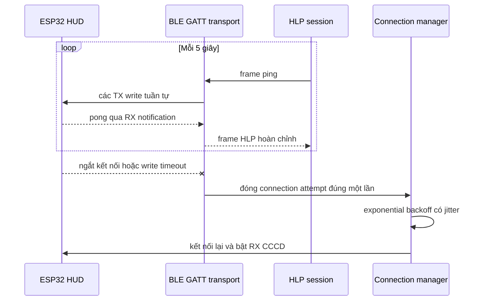
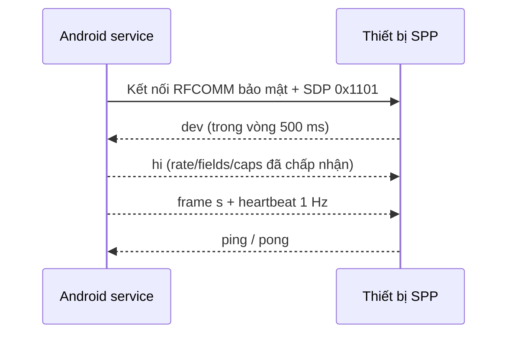
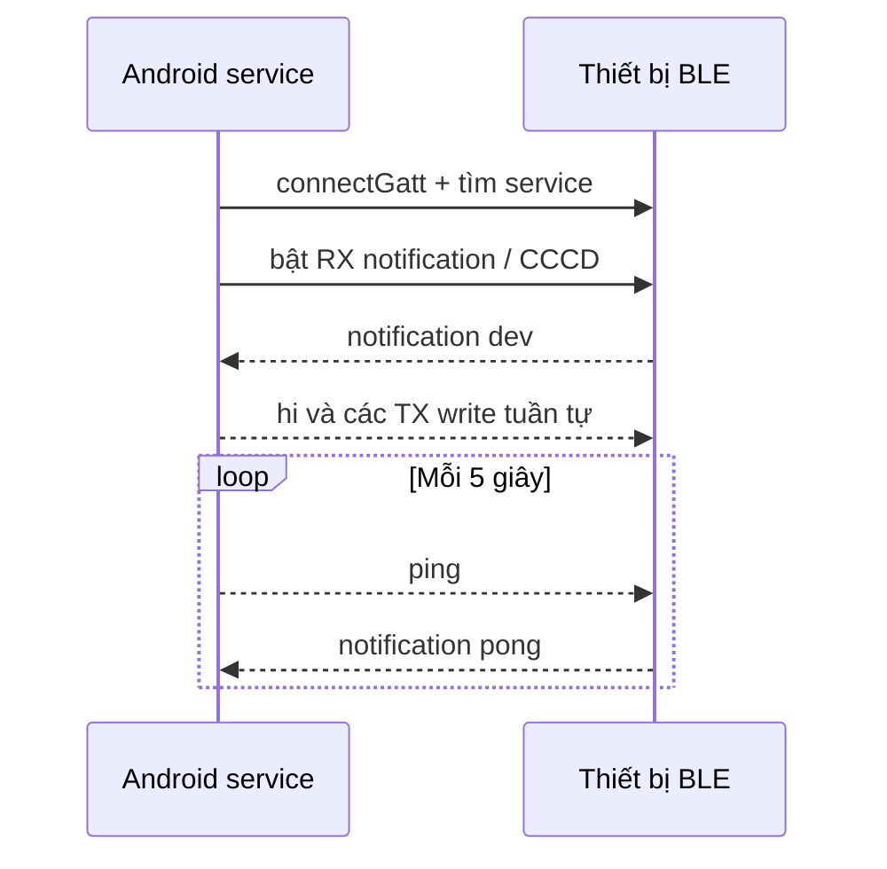
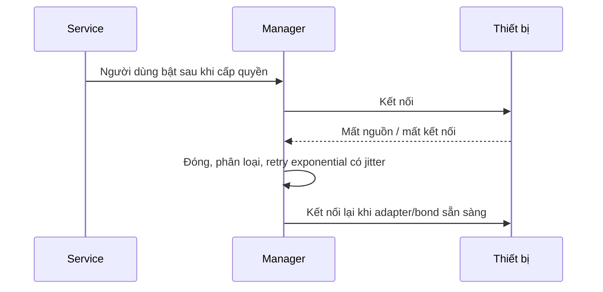
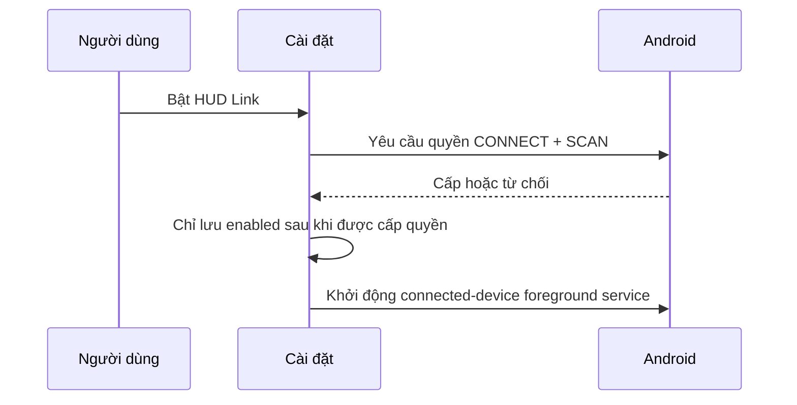
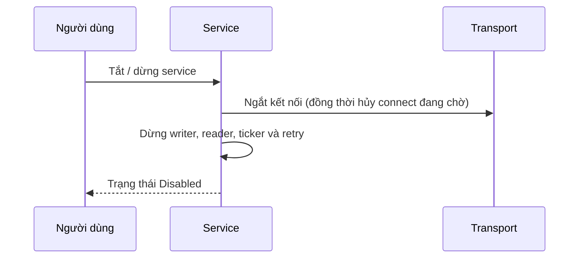

# Waze HUD Link SDK — AI context bundle

> A single-file, UTF-8 Markdown export of the Waze HUD Link developer documentation.
> It includes the HLP/1 protocol, BLE/SPP setup, troubleshooting, hardware notes and the
> complete reference source shown by the documentation site.

Use the HLP/1 specification as the normative wire contract. Treat code samples as reference
implementations that must be adapted and validated for the target hardware.

## Document index

1. [Bắt đầu với Waze HUD Link](#document-1-bat-au-voi-waze-hud-link) — Kiến trúc, luồng dữ liệu và sketch tối thiểu để ESP32 nhận trạng thái điều hướng từ Waze.
2. [Kết nối ESP32 bằng BLE](#document-2-ket-noi-esp32-bang-ble) — Thiết lập NimBLE cho ESP32-C3, C6, H2 và S3 bằng bộ UUID HLP cố định.
3. [Kết nối bằng Bluetooth Classic SPP](#document-3-ket-noi-bang-bluetooth-classic-spp) — Thiết lập RFCOMM SPP cho ESP32 đời đầu, HC-05 và HC-06.
4. [Code mẫu ESP32 BLE](#document-4-code-mau-esp32-ble) — Project ESP-IDF hoàn chỉnh dùng NimBLE, HLP GATT service và notification để nhận dữ liệu Waze.
5. [Code mẫu ESP32 Classic SPP](#document-5-code-mau-esp32-classic-spp) — Project ESP-IDF hoàn chỉnh cho ESP32 dual-mode, gồm RFCOMM SPP và codec HLP dùng chung.
6. [Đặc tả giao thức HLP/1](#document-6-ac-ta-giao-thuc-hlp-1) — Đặc tả message, handshake, field, enum, heartbeat và quy tắc tương thích của HLP/1.
7. [Cấu hình HUD động từ thiết bị](#document-7-cau-hinh-hud-ong-tu-thiet-bi) — Cho ESP32 công bố toggle, slider, lựa chọn và ô nhập để Waze Mod chỉnh cấu hình bằng transaction Apply/ACK nguyên tử.
8. [Cơ chế duy trì & tự động kết nối lại](#document-8-co-che-duy-tri-tu-ong-ket-noi-lai) — Ping/pong 5 giây để quan sát liên kết hai chiều, timeout GATT, loại bỏ callback trùng và tự động kết nối lại.
9. [Android HUD Link](#document-9-android-hud-link) — Lifecycle service, quyền Bluetooth, lựa chọn thiết bị, transport UUID và chẩn đoán.
10. [Phần cứng tương thích](#document-10-phan-cung-tuong-thich) — Chọn transport phù hợp cho từng dòng ESP32 và module Bluetooth serial.
11. [Xử lý lỗi kết nối](#document-11-xu-ly-loi-ket-noi) — Checklist quyền, pairing, transport, UUID và trạng thái retry khi HUD không kết nối.
12. [Ma trận kiểm thử phần cứng](#document-12-ma-tran-kiem-thu-phan-cung) — Các tình huống cần xác nhận trên thiết bị thật trước khi đánh dấu firmware production-ready.

---

# Document 1: Bắt đầu với Waze HUD Link

- Canonical page: /tai-lieu/esp32
- Source: README.md
- Group: Bắt đầu

## 1. Là gì

`HudLink` là bộ **producer** nằm trong mod Waze (`com.waze.gw.HudLink`). Nó gom trạng thái HUD trực
tiếp — tốc độ, giới hạn tốc độ, hướng rẽ kế, khoảng cách, đường hiện tại/kế, ETA, vùng đo tốc độ
trung bình — thành **JSON mỗi dòng** (giao thức **HLP/1**) rồi đẩy qua một transport tới HUD ngoài.
App hiện hỗ trợ **Bluetooth Classic SPP** và **BLE GATT** bằng cùng frame HLP/1.

Vì dữ liệu tách rời khỏi việc vẽ, bạn **chế HUD tùy ý mà không phải build lại Waze**. Nó còn tiếp tục
đẩy dữ liệu **kể cả khi màn điện thoại TẮT** → dùng HUD ngoài cho phép tắt/giảm màn (mát hơn, đỡ pin).

## 2. Kiến trúc

```
Tiến trình Waze ──(hook smali)──► trạng thái Gateway.hud*
                                       │
                                       ▼
                      HudLinkService + HudConnectionManager
                                       │  snapshot HLP/1
                          ┌────────────┴────────────┐
                          ▼                         ▼
                BLE GATT (1–4 Hz)        Classic SPP (1–10 Hz)
                          │                         │
                          └──────────► HUD ngoài ◄──────────┘
```

- Foreground service `HudLinkService` sở hữu transport, handshake, writer và vòng kết nối lại. Hook
  nóng `onSpeedo` chỉ gửi yêu cầu khôi phục service theo cách idempotent và có giới hạn nhịp khi
  Android tạo lại process Waze.
- `HudStateSnapshot` đọc các field `Gateway.hud*` và phát **snapshot đầy đủ** mỗi message (không phải
  delta), nên mất một gói không làm hỏng trạng thái bên nhận.
- Phát khi có thay đổi và vẫn phát state không đổi ít nhất mỗi giây. BLE được giới hạn trong
  **1–4 Hz**; Classic SPP mặc định 8 Hz và nhận yêu cầu tối đa 10 Hz.

## 3. Bật lên

Preferences (file SharedPreferences `waze_hud_gw`):

| key                       | kiểu | mặc định | ý nghĩa |
|---------------------------|------|----------|---------|
| `hud_link`                | bool | false    | bật service HUD Link |
| `hud_link_log`            | bool | false    | log payload HLP RX/TX đã kết nối dưới tag `WazeHudLink` |
| `hud_link_transport`      | int  | 0        | `0` tự động, `1` Classic SPP, `2` BLE GATT |
| `hud_link_device_address` | str  | rỗng     | địa chỉ Bluetooth chính xác đã chọn |
| `hud_link_device_name`    | str  | rỗng     | tên hiển thị của thiết bị đã chọn |
| `hud_link_device_transport` | int | không có | transport lưu cùng thiết bị; picker đồng thời mirror sang `hud_link_transport` |

Mở **Cài đặt Mod → Thiết bị → HUD Link**, cấp quyền Thiết bị lân cận khi được hỏi, chọn đúng
transport/thiết bị rồi bật HUD Link. Thiết bị Classic phải được pair trong Cài đặt Android trước;
thiết bị BLE được tìm trong picker của app theo HLP service UUID cố định.

Bật log không tạo transport giả, nên không thể phát stream nếu chưa kết nối thiết bị. Khi chẩn đoán
với thiết bị thật, chỉ bật `hud_link_log` tạm thời rồi xem:

```bash
adb logcat -s WazeHudLink WazeHudLink-BLE
# {"v":1,"t":"s","nav":0,"spd":47,"lim":50,...,"st":"Nguyễn Trãi","ts":124890}
```

Preference cũ `hud_link_dev` chỉ dùng để migrate. App chỉ chuyển nó thành một thiết bị bonded cụ thể
khi tìm được đúng một kết quả không mơ hồ.

## 4. Luồng dữ liệu (HLP/1)

Mỗi dòng là 1 object JSON, UTF-8, kết bằng `\n`. Mọi message: `{"v":1,"t":"...", ...}`.
Xem `HLP_v1.md` cho spec đầy đủ (handshake `dev`/`hi`, thương lượng năng lực, versioning).

**Message trạng thái** (`"t":"s"`) — các field HUD cần:

| key    | đơn vị / khoảng      | ý nghĩa                                         |
|--------|----------------------|-------------------------------------------------|
| `nav`  | 0/1                  | đang dẫn đường theo tuyến                        |
| `spd`  | km/h                 | tốc độ hiện tại                                 |
| `lim`  | km/h, 0 = không có   | giới hạn tốc độ                                 |
| `over` | 0/1                  | đang vượt tốc (quá ngưỡng của mod)              |
| `trn`  | enum rẽ §4.1         | hướng rẽ kế tiếp                                |
| `trn2` | enum rẽ §4.1         | hướng rẽ sau đó ("rồi…")                        |
| `dst`  | mét, -1 = không có   | khoảng cách tới hướng rẽ kế                     |
| `exit` | ≥0                   | số lối ra ở vòng xuyến                          |
| `st`   | chuỗi                | đường **hiện tại** (đang đi)                     |
| `st2`  | chuỗi                | đường **kế tiếp** (rẽ vào)                       |
| `eta`  | "HH:MM"              | giờ đến dự kiến                                 |
| `rmin` | phút                 | thời gian còn lại                              |
| `rkm`  | km (1 chữ số)        | quãng đường còn lại                            |
| `avg`  | 0/1                  | đang trong **vùng cấm vượt** (VN — xem note)     |
| `avgL/avgR/avgP` | m / km/h / % | vùng: còn lại / tốc độ khuyến nghị / phần trăm |
| `alr`  | enum alert §4.2      | biển/cảnh báo **gần nhất** (0 = không)          |
| `alrD` | mét, -1 = không có   | khoảng cách tới biển gần nhất                   |
| `alrV` | km/h                 | giá trị của biển gần nhất (giới hạn sắp tới cho biển giảm tốc) |
| `alrs` | mảng                 | tối đa 4 biển kế `[{k,d,v}]`, gần→xa (opt-in)   |
| `ts`   | ms                   | uptime producer (kiểm cũ/mới, thứ tự)          |

Quy ước vắng: `0` cho `lim`/`exit`/`avg*`; `-1` cho `dst`. `alrV`/`alrs` **omit hẳn** khi không có.
Thiếu key ⇒ dùng giá trị mặc định.

> **Vùng cấm vượt (`avg`).** VN không có camera đo tốc độ trung bình; editor tag hình học đó thành
> **cấm vượt**, Waze vẫn giao dưới dạng "avg-speed zone". Hiện biển **cấm vượt** + đếm ngược `avgL`,
> đừng vẽ camera. / *Vietnam has no average-speed cameras; render a no-passing sign, not a camera.*

> **Cảnh báo (`alr`/`alrs`).** Khi có cảnh báo, `alr`/`alrD`/`alrV` mô tả biển **gần nhất** và
> **mirror `alrs[0]`** (consumer không parse mảng vẫn có biển gần nhất). `alrs` = danh sách đầy đủ
> (≤4, gần→xa), **opt-in** — phải khai `alrs` trong `dev.want.fields` mới nhận. Trong `alrs`, key loại
> là **`k`** (không phải `t` — `t` là key loại-message ở envelope): `[{"k":2,"d":300},{"k":8,"d":800,"v":40}]`.
> `alrV`/`v` chỉ có với biển mang giá trị (giảm tốc → giới hạn mới); còn lại omit.
> Enum alert: `1` police · `2` camera tốc · `3` camera đèn đỏ · `4` hazard · `5` tai nạn · `6` kẹt xe ·
> `7` đóng đường · `8` giảm tốc (`v`=giới hạn mới) · `9` cấm vượt.

**Enum rẽ** (`trn`,`trn2`): `0` không · `1` đi thẳng · `2` trái · `3` phải · `4/5` chếch trái/phải ·
`6/7` gắt trái/phải · `8` quay đầu · `10-12` vòng xuyến / trái / phải (dùng `exit`) · `13/14` giữ
trái/phải · `15/16` ra nhánh trái/phải · `17` đến nơi. (Bảng đầy đủ ở `HLP_v1.md §4.1`.)

## 5. Viết bên nhận (ESP32, Bluetooth SPP)

Sketch Arduino tối thiểu — đọc dòng, parse, vẽ:

```cpp
#include "BluetoothSerial.h"
#include <ArduinoJson.h>

BluetoothSerial SerialBT;

void setup() {
  Serial.begin(115200);
  SerialBT.begin("WazeHUD");          // điện thoại kết nối tới tên này
}

void loop() {
  static char line[512];
  static size_t n = 0;
  while (SerialBT.available()) {
    char c = SerialBT.read();
    if (c == '\n') {                  // đã đủ 1 message HLP
      line[n] = 0; n = 0;
      StaticJsonDocument<512> doc;
      if (deserializeJson(doc, line)) continue;   // bỏ dòng hỏng, resync ở '\n' kế
      const char* t = doc["t"] | "";
      if (strcmp(t, "s") == 0) {
        int   spd = doc["spd"] | 0;
        int   lim = doc["lim"] | 0;
        int   trn = doc["trn"] | 0;
        int   dst = doc["dst"] | -1;
        const char* st = doc["st"] | "";
        // TODO: vẽ spd / lim / bitmap mũi tên theo trn / dst / st …
      }
    } else if (n < sizeof(line) - 1) {
      line[n++] = c;
    } else {
      n = 0;                          // tràn → resync
    }
  }
}
```

Bên nhận có thể (tùy chọn) gửi khai báo `dev` để thương lượng rate/fields; nếu im lặng, producer tự
đẩy default hợp lý sau 500 ms (xem `HLP_v1.md §2.5`).

## 6. Trạng thái

- **Producer:** HLP/1 đã có trên Classic SPP bảo mật và BLE GATT.
- **Ví dụ ESP32:** đã có raw receiver BLE/SPP, framing giới hạn, handshake và ping/pong.
- **Firmware sản phẩm:** decoder field, driver màn hình và renderer tùy thuộc thiết bị.

---

# Document 2: Kết nối ESP32 bằng BLE

- Canonical page: /tai-lieu/esp32/ket-noi-ble
- Source: vi/ESP32_BLE_SETUP.md
- Group: Kết nối

Dự án `esp32-hlp-ble` sử dụng NimBLE và bộ UUID service/characteristic HLP đã được cố định. Đây là bản tham chiếu cho các dòng hỗ trợ BLE như ESP32-C3, C6, H2 và S3. Ứng dụng dùng notification để gửi dữ liệu từ thiết bị tới Android và acknowledged write để gửi dữ liệu từ Android tới thiết bị. Frame HLP được ghép lại theo ký tự LF, không phụ thuộc vào ranh giới packet ATT.

Hãy dùng ESP-IDF 5.5.x. File `sdkconfig.defaults` đi kèm bật NimBLE và controller ở chế độ chỉ BLE. Ví dụ này chỉ nhận HLP dạng thô: mỗi state hợp lệ được in thành `HLP state` trong serial monitor. Khi tích hợp vào firmware, hãy thay `state_line()` bằng queue hoặc decoder của ứng dụng; ví dụ không kèm renderer màn hình.

```bash
idf.py set-target esp32s3
idf.py build
idf.py -p COM5 flash monitor
```

Implementation hoạt động với ATT MTU mặc định. Dữ liệu Android ghi xuống có thể đến theo các chunk bất kỳ, còn notification dùng cho handshake từ thiết bị được chia theo ATT payload đã thương lượng. Firmware không yêu cầu 2M PHY hoặc một mức connection priority cụ thể.

## Contract khi chạy

- TX nhận write with response. Android yêu cầu MTU 247, fallback về MTU 23 và gửi chunk không lớn hơn
  `MTU - 3`, với timeout ba giây cho mỗi chunk.
- Callback GATT copy byte vào queue giới hạn; việc ghép frame LF và parse JSON chạy trong protocol task.
- RX chỉ dùng notify và có CCCD `0x2902`. Firmware gửi `dev` ngay sau khi Android bật notification và
  yêu cầu 4 Hz, là rate BLE tối đa được chấp nhận.
- Android gửi `ping` mỗi năm giây. Protocol task trả `pong` trước khi chuyển state sang tác vụ ứng
  dụng có thể chạy chậm.
- Khi ngắt kết nối, firmware khởi động lại advertising để Android có thể retry theo lịch.

Sau handshake thành công, serial monitor sẽ có output tương tự:

```text
I hlp_ble: HLP state: {"v":1,"t":"s","nav":1,"spd":47,...}
```

---

# Document 3: Kết nối bằng Bluetooth Classic SPP

- Canonical page: /tai-lieu/esp32/ket-noi-spp
- Source: vi/ESP32_SPP_SETUP.md
- Group: Kết nối

Dự án `esp32-hlp-spp` là implementation ESP-IDF tham chiếu cho ESP32 dual-mode đời đầu và các module Bluetooth Classic serial. Dự án đăng ký RFCOMM SPP service qua SDP bằng UUID `00001101-0000-1000-8000-00805F9B34FB`.

Hãy dùng ESP-IDF 5.5.x. File `sdkconfig.defaults` đi kèm bật Bluedroid và Classic SPP. Ví dụ này chỉ nhận HLP dạng thô: mỗi state hợp lệ được in thành `HLP state` trong serial monitor. Khi tích hợp vào firmware, hãy thay `state_line()` bằng queue hoặc decoder của ứng dụng; ví dụ không kèm renderer màn hình.

```bash
idf.py set-target esp32
idf.py build
idf.py -p COM5 flash monitor
```

Pair thiết bị `WazeHUD` trong phần cài đặt Bluetooth của Android, chọn đúng thiết bị tại **Cài đặt Mod → Thiết bị → HUD Link**, sau đó bật service. Firmware dùng receive buffer giới hạn 512 byte và xử lý được cả frame bị chia nhỏ lẫn nhiều dòng đến cùng lúc.

Module HC-05/HC-06 phải được pair trước trong phần cài đặt Android. Baud rate UART của module không ảnh hưởng tới framing RFCOMM ở tầng ứng dụng; HLP sử dụng JSON Lines mã hóa UTF-8.

---

# Document 4: Code mẫu ESP32 BLE

- Canonical page: /tai-lieu/esp32/vi-du-esp32-ble
- Source: esp32-hlp-ble/
- Group: Code mẫu

Ví dụ ESP-IDF 5.5.x này dành cho ESP32-C3/C6/H2/S3. `main.c` dựng HLP GATT service, nhận raw state từ Android qua TX write và in state hợp lệ trong serial monitor. Chiều RX notification chỉ dùng cho handshake `dev`/`pong`; project không kèm renderer màn hình.

## Build và flash

```bash
cd esp32-hlp-ble
idf.py set-target esp32s3
idf.py build
idf.py -p COM5 flash monitor
```

Thay `COM5` bằng cổng serial của board. Sau khi flash, chọn đúng transport và thiết bị trong Cài đặt Mod → Thiết bị → HUD Link.

## Cấu trúc project

```text
esp32-hlp-ble/CMakeLists.txt
esp32-hlp-ble/sdkconfig.defaults
esp32-hlp-ble/main/CMakeLists.txt
esp32-hlp-ble/main/main.c
```

## `CMakeLists.txt`

```cmake
cmake_minimum_required(VERSION 3.16)
include($ENV{IDF_PATH}/tools/cmake/project.cmake)
project(esp32_hlp_ble)
```

## `sdkconfig.defaults`

```ini
# ESP-IDF 5.5.x: enable the NimBLE host and BLE-only controller mode.
CONFIG_BT_ENABLED=y
CONFIG_BTDM_CTRL_MODE_BLE_ONLY=y
CONFIG_BTDM_CTRL_MODE_BR_EDR_ONLY=n
CONFIG_BTDM_CTRL_MODE_BTDM=n
CONFIG_BT_BLUEDROID_ENABLED=n
CONFIG_BT_NIMBLE_ENABLED=y
```

## `main/CMakeLists.txt`

```cmake
idf_component_register(
    SRCS "main.c" "../../esp32-hlp-spp/shared/hlp_core.c"
         "../../esp32-hlp-spp/shared/hlp_messages.c"
         "../../esp32-hlp-spp/shared/hlp_device_config.c"
    INCLUDE_DIRS "." "../../esp32-hlp-spp/shared"
    REQUIRES bt nvs_flash json
)
```

## `main/main.c`

```c
#include "host/ble_att.h"
#include "host/ble_hs.h"
#include "host/ble_uuid.h"
#include "nimble/nimble_port.h"
#include "nimble/nimble_port_freertos.h"
#include "host/ble_hs_id.h"
#include "services/gap/ble_svc_gap.h"
#include "services/gatt/ble_svc_gatt.h"
#include "esp_log.h"
#include "esp_system.h"
#include "nvs_flash.h"
#include "freertos/FreeRTOS.h"
#include "freertos/queue.h"
#include "freertos/task.h"
#include "hlp_core.h"
#include "hlp_messages.h"
#include "hlp_device_config.h"
#include <string.h>

static const char *TAG = "hlp_ble";
static const ble_uuid128_t SERVICE =
    BLE_UUID128_INIT(0x01,0x00,0x4c,0x50,0x4c,0x48,0x9d,0x9a,
                     0x48,0x4c,0x6e,0x4d,0x01,0x00,0x7e,0x8a);
static const ble_uuid128_t TX =
    BLE_UUID128_INIT(0x01,0x00,0x4c,0x50,0x4c,0x48,0x9d,0x9a,
                     0x48,0x4c,0x6e,0x4d,0x02,0x00,0x7e,0x8a);
static const ble_uuid128_t RX =
    BLE_UUID128_INIT(0x01,0x00,0x4c,0x50,0x4c,0x48,0x9d,0x9a,
                     0x48,0x4c,0x6e,0x4d,0x03,0x00,0x7e,0x8a);
static const ble_uuid128_t CAPABILITIES =
    BLE_UUID128_INIT(0x01,0x00,0x4c,0x50,0x4c,0x48,0x9d,0x9a,
                     0x48,0x4c,0x6e,0x4d,0x04,0x00,0x7e,0x8a);

typedef struct { uint16_t length; uint8_t bytes[HLP_MAX_FRAME]; } ble_chunk_t;
static QueueHandle_t chunks;
static hlp_rx_t receiver;
static uint16_t connection = BLE_HS_CONN_HANDLE_NONE;
static uint16_t rx_value_handle;
static bool notify_enabled;
static volatile bool send_dev_pending;
static uint8_t own_addr_type;
static struct ble_gap_adv_params adv_params;

static void send_line(const char *line, void *user) {
    (void)user;
    if (!notify_enabled || connection == BLE_HS_CONN_HANDLE_NONE) return;
    size_t length = strlen(line);
    if (length + 1 > HLP_MAX_FRAME) return;
    char frame[HLP_MAX_FRAME];
    memcpy(frame, line, length);
    frame[length++] = '\n';
    uint16_t mtu = ble_att_mtu(connection);
    size_t payload = mtu > 3 ? mtu - 3 : BLE_ATT_MTU_DFLT - 3;
    for (size_t offset = 0; offset < length; offset += payload) {
        size_t chunk_length = length - offset;
        if (chunk_length > payload) chunk_length = payload;

        int rc = BLE_HS_ENOMEM;
        for (int attempt = 0; attempt < 3 && rc == BLE_HS_ENOMEM; ++attempt) {
            struct os_mbuf *om = ble_hs_mbuf_from_flat(frame + offset, chunk_length);
            if (!om) {
                rc = BLE_HS_ENOMEM;
            } else {
                rc = ble_gatts_notify_custom(connection, rx_value_handle, om);
            }
            if (rc == BLE_HS_ENOMEM) vTaskDelay(pdMS_TO_TICKS(5));
        }
        if (rc != 0) {
            ESP_LOGW(TAG, "RX notification failed: rc=%d", rc);
            return;
        }
    }
}

static void state_line(const char *line, size_t length, void *user) {
    (void)user;
    ESP_LOGI(TAG, "HLP state: %.*s", (int)length, line);
}

static void on_line(const char *line, size_t length, void *user) {
    (void)user;
    hlp_handle_line(line, length, send_line, state_line, NULL);
}

static int access_cb(uint16_t conn_handle, uint16_t attr_handle,
                     struct ble_gatt_access_ctxt *ctxt, void *arg) {
    (void)attr_handle; (void)arg;
    if (ctxt->op == BLE_GATT_ACCESS_OP_WRITE_CHR) {
        size_t length = OS_MBUF_PKTLEN(ctxt->om);
        if (length > HLP_MAX_FRAME) return BLE_ATT_ERR_INVALID_ATTR_VALUE_LEN;
        ble_chunk_t chunk = { .length = length };
        if (os_mbuf_copydata(ctxt->om, 0, length, chunk.bytes) != 0)
            return BLE_ATT_ERR_UNLIKELY;
        if (xQueueSend(chunks, &chunk, 0) != pdTRUE)
            return BLE_ATT_ERR_INSUFFICIENT_RES;
        return 0;
    }
    if (ctxt->op == BLE_GATT_ACCESS_OP_READ_CHR) {
        const char caps[] = "{\"v\":1,\"caps\":{\"transport\":\"ble\",\"maxFrame\":512}}\n";
        return os_mbuf_append(ctxt->om, caps, sizeof(caps) - 1) == 0
                ? 0 : BLE_ATT_ERR_INSUFFICIENT_RES;
    }
    (void)conn_handle;
    return BLE_ATT_ERR_UNLIKELY;
}

static struct ble_gatt_chr_def characteristics[] = {
    { .uuid = &TX.u, .access_cb = access_cb,
      .flags = BLE_GATT_CHR_F_WRITE },
    { .uuid = &RX.u, .val_handle = &rx_value_handle,
      .flags = BLE_GATT_CHR_F_NOTIFY },
    { .uuid = &CAPABILITIES.u, .access_cb = access_cb,
      .flags = BLE_GATT_CHR_F_READ },
    { 0 }
};
static const struct ble_gatt_svc_def services[] = {
    { .type = BLE_GATT_SVC_TYPE_PRIMARY, .uuid = &SERVICE.u,
      .characteristics = characteristics },
    { 0 }
};

static int gap_event(struct ble_gap_event *event, void *arg) {
    (void)arg;
    switch (event->type) {
        case BLE_GAP_EVENT_CONNECT:
            if (event->connect.status != 0) {
                connection = BLE_HS_CONN_HANDLE_NONE;
                ble_gap_adv_start(own_addr_type, NULL, BLE_HS_FOREVER,
                                  &adv_params, gap_event, NULL);
            } else connection = event->connect.conn_handle;
            break;
        case BLE_GAP_EVENT_DISCONNECT:
            connection = BLE_HS_CONN_HANDLE_NONE;
            notify_enabled = false;
            ble_gap_adv_start(own_addr_type, NULL, BLE_HS_FOREVER,
                              &adv_params, gap_event, NULL);
            break;
        case BLE_GAP_EVENT_SUBSCRIBE:
            if (event->subscribe.attr_handle == rx_value_handle) {
                notify_enabled = event->subscribe.cur_notify;
                if (notify_enabled) send_dev_pending = true;
            }
            break;
        default: break;
    }
    return 0;
}

static void advertise(void) {
    struct ble_hs_adv_fields fields = {0};
    fields.flags = BLE_HS_ADV_F_DISC_GEN | BLE_HS_ADV_F_BREDR_UNSUP;
    fields.name = (uint8_t *)"WazeHUD";
    fields.name_len = 7;
    fields.name_is_complete = 1;
    fields.uuids128 = (ble_uuid128_t *)&SERVICE;
    fields.num_uuids128 = 1;
    fields.uuids128_is_complete = 1;
    int rc = ble_gap_adv_set_fields(&fields);
    if (rc != 0) {
        ESP_LOGE(TAG, "Cannot set advertising fields: rc=%d", rc);
        return;
    }
    adv_params = (struct ble_gap_adv_params){0};
    adv_params.conn_mode = BLE_GAP_CONN_MODE_UND;
    adv_params.disc_mode = BLE_GAP_DISC_MODE_GEN;
    rc = ble_gap_adv_start(own_addr_type, NULL, BLE_HS_FOREVER,
                           &adv_params, gap_event, NULL);
    if (rc != 0) ESP_LOGE(TAG, "Cannot start advertising: rc=%d", rc);
}

static void on_sync(void) {
    int rc = ble_hs_id_infer_auto(0, &own_addr_type);
    if (rc != 0) {
        ESP_LOGE(TAG, "Cannot infer address type: rc=%d", rc);
        return;
    }
    advertise();
}

static void host_task(void *arg) {
    (void)arg;
    nimble_port_run();
    nimble_port_freertos_deinit();
}

static void protocol_task(void *arg) {
    (void)arg;
    ble_chunk_t chunk;
    for (;;) {
        if (send_dev_pending) {
            send_dev_pending = false;
            hlp_send_dev(send_line, NULL, "ble", "ESP32-BLE", "1.0.0", 4);
        }
        if (xQueueReceive(chunks, &chunk, pdMS_TO_TICKS(100)) == pdTRUE
                && chunk.length > 0)
            hlp_rx_feed(&receiver, chunk.bytes, chunk.length);
    }
}

void app_main(void) {
    esp_err_t err = nvs_flash_init();
    if (err == ESP_ERR_NVS_NO_FREE_PAGES || err == ESP_ERR_NVS_NEW_VERSION_FOUND) {
        ESP_ERROR_CHECK(nvs_flash_erase());
        err = nvs_flash_init();
    }
    ESP_ERROR_CHECK(err);
    hlp_device_config_init();

    chunks = xQueueCreate(16, sizeof(ble_chunk_t));
    if (!chunks) {
        ESP_LOGE(TAG, "Cannot create receive queue");
        return;
    }
    hlp_rx_init(&receiver, on_line, NULL);
    ESP_ERROR_CHECK(nimble_port_init());
    ble_svc_gap_init();
    ble_svc_gatt_init();
    int rc = ble_gatts_count_cfg(services);
    if (rc == 0) rc = ble_gatts_add_svcs(services);
    if (rc == 0) rc = ble_svc_gap_device_name_set("WazeHUD");
    if (rc != 0) {
        ESP_LOGE(TAG, "Cannot configure GATT server: rc=%d", rc);
        return;
    }
    ble_hs_cfg.sync_cb = on_sync;
    if (xTaskCreate(protocol_task, "hlp_protocol", 4096, NULL, 5, NULL) != pdPASS) {
        ESP_LOGE(TAG, "Cannot create protocol task");
        return;
    }
    nimble_port_freertos_init(host_task);
    ESP_LOGI(TAG, "HLP BLE service started");
}
```


---

# Document 5: Code mẫu ESP32 Classic SPP

- Canonical page: /tai-lieu/esp32/vi-du-esp32-spp
- Source: esp32-hlp-spp/
- Group: Code mẫu

Ví dụ ESP-IDF 5.5.x này dành cho ESP32 dual-mode đời đầu. Firmware mở RFCOMM SPP service tên `WazeHUD`, nhận raw state qua codec HLP và in state hợp lệ trong serial monitor. Project không kèm decoder field hay renderer màn hình.

## Build và flash

```bash
cd esp32-hlp-spp
idf.py set-target esp32
idf.py build
idf.py -p COM5 flash monitor
```

Thay `COM5` bằng cổng serial của board. Sau khi flash, chọn đúng transport và thiết bị trong Cài đặt Mod → Thiết bị → HUD Link.

## Cấu trúc project

```text
esp32-hlp-spp/CMakeLists.txt
esp32-hlp-spp/sdkconfig.defaults
esp32-hlp-spp/main/CMakeLists.txt
esp32-hlp-spp/main/main.c
esp32-hlp-spp/shared/hlp_core.h
esp32-hlp-spp/shared/hlp_core.c
esp32-hlp-spp/shared/hlp_messages.h
esp32-hlp-spp/shared/hlp_messages.c
esp32-hlp-spp/shared/hlp_device_config.h
esp32-hlp-spp/shared/hlp_device_config.c
```

## `CMakeLists.txt`

```cmake
cmake_minimum_required(VERSION 3.16)
include($ENV{IDF_PATH}/tools/cmake/project.cmake)
project(esp32_hlp_spp)
```

## `sdkconfig.defaults`

```ini
# ESP-IDF 5.5.x: enable Bluedroid and Classic Bluetooth SPP.
CONFIG_BT_ENABLED=y
CONFIG_BTDM_CTRL_MODE_BLE_ONLY=n
CONFIG_BTDM_CTRL_MODE_BR_EDR_ONLY=y
CONFIG_BTDM_CTRL_MODE_BTDM=n
CONFIG_BT_CLASSIC_ENABLED=y
CONFIG_BT_SPP_ENABLED=y
CONFIG_BT_BLE_ENABLED=n
```

## `main/CMakeLists.txt`

```cmake
idf_component_register(
    SRCS "main.c" "../shared/hlp_core.c" "../shared/hlp_messages.c"
         "../shared/hlp_device_config.c"
    INCLUDE_DIRS "." "../shared"
    REQUIRES bt nvs_flash json
)
```

## `main/main.c`

```c
#include "esp_spp_api.h"
#include "esp_bt_device.h"
#include "esp_bt_main.h"
#include "esp_gap_bt_api.h"
#include "esp_log.h"
#include "esp_system.h"
#include "freertos/FreeRTOS.h"
#include "freertos/queue.h"
#include "freertos/task.h"
#include "nvs_flash.h"
#include "hlp_core.h"
#include "hlp_messages.h"
#include "hlp_device_config.h"
#include <string.h>

#define HLP_QUEUE_DEPTH 8
typedef struct { size_t length; char line[HLP_MAX_FRAME]; } hlp_event_t;
typedef struct { size_t length; uint8_t bytes[HLP_MAX_FRAME]; } hlp_tx_event_t;
static const char *TAG = "hlp_spp";
static QueueHandle_t events;
static QueueHandle_t tx_events;
static hlp_rx_t receiver;
static uint32_t spp_handle;
static bool link_up;
static volatile bool spp_congested;
static volatile bool spp_write_pending;
static volatile esp_spp_status_t spp_write_status;
static TaskHandle_t tx_task_handle;
static volatile bool send_dev_pending;

static void send_line(const char *line, void *user) {
    (void)user;
    if (!link_up || !line) return;
    size_t length = strlen(line);
    if (length + 1 > HLP_MAX_FRAME) return;
    hlp_tx_event_t event = { .length = length + 1 };
    memcpy(event.bytes, line, length);
    event.bytes[length] = '\n';
    if (xQueueSend(tx_events, &event, 0) != pdTRUE)
        ESP_LOGW(TAG, "SPP transmit queue is full");
}

static void on_line(const char *line, size_t length, void *user) {
    (void)user;
    hlp_event_t event = { .length = length };
    if (length >= sizeof(event.line)) return;
    memcpy(event.line, line, length);
    event.line[length] = 0;
    (void)xQueueSend(events, &event, 0);
}

static void state_line(const char *line, size_t length, void *user) {
    (void)user;
    ESP_LOGI(TAG, "HLP state: %.*s", (int)length, line);
}

static void tx_task(void *arg) {
    (void)arg;
    hlp_tx_event_t event;
    for (;;) {
        if (xQueueReceive(tx_events, &event, portMAX_DELAY) != pdTRUE) continue;
        while (link_up) {
            while (link_up && spp_congested)
                ulTaskNotifyTake(pdTRUE, portMAX_DELAY);
            if (!link_up) break;

            spp_write_pending = true;
            esp_err_t err = esp_spp_write(spp_handle, event.length, event.bytes);
            if (err != ESP_OK) {
                spp_write_pending = false;
                ESP_LOGW(TAG, "SPP write failed: %s", esp_err_to_name(err));
                vTaskDelay(pdMS_TO_TICKS(20));
                continue;
            }
            while (link_up && spp_write_pending)
                ulTaskNotifyTake(pdTRUE, portMAX_DELAY);
            if (!link_up || spp_write_status == ESP_SPP_SUCCESS) break;
        }
    }
}

static void protocol_task(void *arg) {
    hlp_event_t event;
    for (;;) {
        if (send_dev_pending) {
            send_dev_pending = false;
            hlp_send_dev(send_line, NULL, "spp", "ESP32-Classic", "1.0.0", 8);
        }
        if (xQueueReceive(events, &event, pdMS_TO_TICKS(100)) == pdTRUE)
            hlp_handle_line(event.line, event.length, send_line, state_line, NULL);
    }
}

static void spp_callback(esp_spp_cb_event_t event, esp_spp_cb_param_t *param) {
    switch (event) {
        case ESP_SPP_INIT_EVT:
            if (esp_spp_start_srv(ESP_SPP_SEC_AUTHENTICATE, ESP_SPP_ROLE_SLAVE,
                                  0, "HLP SPP") != ESP_OK
                    || esp_bt_gap_set_scan_mode(
                            ESP_BT_SCAN_MODE_CONNECTABLE_DISCOVERABLE) != ESP_OK)
                ESP_LOGE(TAG, "Cannot start discoverable SPP server");
            break;
        case ESP_SPP_SRV_OPEN_EVT:
            spp_handle = param->srv_open.handle;
            link_up = true;
            spp_congested = false;
            send_dev_pending = true;
            if (tx_task_handle) xTaskNotifyGive(tx_task_handle);
            break;
        case ESP_SPP_DATA_IND_EVT:
            hlp_rx_feed(&receiver, param->data_ind.data, param->data_ind.len);
            break;
        case ESP_SPP_CLOSE_EVT:
            link_up = false;
            spp_handle = 0;
            spp_write_pending = false;
            if (tx_task_handle) xTaskNotifyGive(tx_task_handle);
            break;
        case ESP_SPP_WRITE_EVT:
            spp_write_status = param->write.status;
            spp_congested = param->write.cong;
            spp_write_pending = false;
            if (tx_task_handle) xTaskNotifyGive(tx_task_handle);
            break;
        case ESP_SPP_CONG_EVT:
            spp_congested = param->cong.cong;
            if (tx_task_handle) xTaskNotifyGive(tx_task_handle);
            break;
        default:
            break;
    }
}

void app_main(void) {
    esp_err_t err = nvs_flash_init();
    if (err == ESP_ERR_NVS_NO_FREE_PAGES || err == ESP_ERR_NVS_NEW_VERSION_FOUND) {
        ESP_ERROR_CHECK(nvs_flash_erase());
        err = nvs_flash_init();
    }
    ESP_ERROR_CHECK(err);
    hlp_device_config_init();

    events = xQueueCreate(HLP_QUEUE_DEPTH, sizeof(hlp_event_t));
    tx_events = xQueueCreate(HLP_QUEUE_DEPTH, sizeof(hlp_tx_event_t));
    if (!events || !tx_events) {
        ESP_LOGE(TAG, "Cannot create HLP queues");
        return;
    }
    hlp_rx_init(&receiver, on_line, NULL);
    if (xTaskCreate(protocol_task, "hlp_protocol", 4096, NULL, 5, NULL) != pdPASS
            || xTaskCreate(tx_task, "hlp_spp_tx", 3072, NULL, 5, &tx_task_handle) != pdPASS) {
        ESP_LOGE(TAG, "Cannot create HLP tasks");
        return;
    }

    ESP_ERROR_CHECK(esp_bt_controller_mem_release(ESP_BT_MODE_BLE));
    esp_bt_controller_config_t config = BT_CONTROLLER_INIT_CONFIG_DEFAULT();
    ESP_ERROR_CHECK(esp_bt_controller_init(&config));
    ESP_ERROR_CHECK(esp_bt_controller_enable(ESP_BT_MODE_CLASSIC_BT));
    ESP_ERROR_CHECK(esp_bluedroid_init());
    ESP_ERROR_CHECK(esp_bluedroid_enable());
    ESP_ERROR_CHECK(esp_bt_dev_set_device_name("WazeHUD"));
    ESP_ERROR_CHECK(esp_spp_register_callback(spp_callback));
    ESP_ERROR_CHECK(esp_spp_init(ESP_SPP_MODE_CB));
}
```

## `shared/hlp_core.h`

```c
#pragma once
#include <stdbool.h>
#include <stddef.h>
#include <stdint.h>

#define HLP_MAX_FRAME 512
#define HLP_MAX_PAYLOAD (HLP_MAX_FRAME - 1)

typedef void (*hlp_line_cb_t)(const char *line, size_t length, void *user);

typedef struct {
    uint8_t buffer[HLP_MAX_FRAME]; /* one extra byte for a temporary NUL */
    size_t length;
    bool overflow;
    uint32_t oversized;
    uint32_t malformed_utf8;
    hlp_line_cb_t callback;
    void *user;
} hlp_rx_t;

void hlp_rx_init(hlp_rx_t *rx, hlp_line_cb_t callback, void *user);
void hlp_rx_feed(hlp_rx_t *rx, const uint8_t *data, size_t length);
bool hlp_utf8_valid(const uint8_t *data, size_t length);
```

## `shared/hlp_core.c`

```c
#include "hlp_core.h"

static void reset(hlp_rx_t *rx) {
    rx->length = 0;
    rx->overflow = false;
}

bool hlp_utf8_valid(const uint8_t *data, size_t length) {
    size_t i = 0;
    while (i < length) {
        uint8_t c = data[i++];
        if (c < 0x80) continue;
        size_t need = c >= 0xF0 ? 3 : c >= 0xE0 ? 2 : c >= 0xC2 ? 1 : 0;
        if (!need || i + need > length) return false;
        uint32_t code = c & ((1u << (6 - need)) - 1u);
        for (size_t j = 0; j < need; ++j) {
            uint8_t part = data[i++];
            if ((part & 0xC0) != 0x80) return false;
            code = (code << 6) | (part & 0x3F);
        }
        if (code > 0x10FFFF || (code >= 0xD800 && code <= 0xDFFF)
                || (need == 1 && code < 0x80)
                || (need == 2 && code < 0x800)
                || (need == 3 && code < 0x10000)) return false;
    }
    return true;
}

void hlp_rx_init(hlp_rx_t *rx, hlp_line_cb_t callback, void *user) {
    *rx = (hlp_rx_t){0};
    rx->callback = callback;
    rx->user = user;
}

void hlp_rx_feed(hlp_rx_t *rx, const uint8_t *data, size_t length) {
    if (!rx || !data) return;
    for (size_t i = 0; i < length; ++i) {
        uint8_t c = data[i];
        if (c == '\n') {
            if (rx->overflow) {
                rx->oversized++;
            } else {
                size_t n = rx->length;
                if (n && rx->buffer[n - 1] == '\r') --n;
                if (!hlp_utf8_valid(rx->buffer, n)) {
                    rx->malformed_utf8++;
                } else if (rx->callback) {
                    rx->buffer[n] = 0;
                    rx->callback((const char *)rx->buffer, n, rx->user);
                }
            }
            reset(rx);
        } else if (!rx->overflow) {
            if (rx->length >= HLP_MAX_PAYLOAD) rx->overflow = true;
            else rx->buffer[rx->length++] = c;
        }
    }
}
```

## `shared/hlp_messages.h`

```c
#pragma once
#include <stddef.h>

typedef void (*hlp_send_line_t)(const char *line, void *user);
typedef void (*hlp_state_line_t)(const char *line, size_t length, void *user);

void hlp_send_dev(hlp_send_line_t send, void *user, const char *transport,
                  const char *model, const char *firmware, unsigned rate);
void hlp_handle_line(const char *line, size_t length, hlp_send_line_t send,
                     hlp_state_line_t state, void *user);
```

## `shared/hlp_messages.c`

```c
#include "hlp_messages.h"
#include "hlp_device_config.h"
#include "cJSON.h"
#include <stdio.h>
#include <string.h>

void hlp_send_dev(hlp_send_line_t send, void *user, const char *transport,
                  const char *model, const char *firmware, unsigned rate) {
    if (!send) return;
    char line[480];
    snprintf(line, sizeof(line),
             "{\"v\":1,\"t\":\"dev\",\"name\":\"%s\",\"fw\":\"%s\","
             "\"proto\":[1],\"want\":{\"rate\":%u,\"fields\":[\"nav\",\"spd\",\"lim\","
             "\"over\",\"trn\",\"trn2\",\"dst\",\"exit\",\"st\",\"st2\",\"eta\","
             "\"rmin\",\"rkm\",\"avg\",\"avgL\",\"avgR\",\"avgP\",\"alr\",\"alrD\","
             "\"alrV\",\"alrs\"]},\"can\":[\"speed\",\"limit\",\"turn\",\"street\","
             "\"eta\",\"avgzone\",\"alerts\"],\"transport\":\"%s\"}",
             model ? model : "ESP32", firmware ? firmware : "0.0.0", rate,
             transport ? transport : "unknown");
    send(line, user);
}

void hlp_handle_line(const char *line, size_t length, hlp_send_line_t send,
                     hlp_state_line_t state, void *user) {
    (void)length; // hlp_core supplies a NUL-terminated bounded line.
    cJSON *root = cJSON_Parse(line);
    if (!root || !cJSON_IsObject(root)) {
        if (root) cJSON_Delete(root);
        return;
    }
    cJSON *version = cJSON_GetObjectItemCaseSensitive(root, "v");
    cJSON *type = cJSON_GetObjectItemCaseSensitive(root, "t");
    if (!cJSON_IsNumber(version) || version->valueint != 1 || !cJSON_IsString(type)) {
        cJSON_Delete(root);
        return;
    }
    if (hlp_device_config_handle(root, send, user)) {
        /* Dynamic config messages are consumed by the device-config module. */
    } else if (strcmp(type->valuestring, "ping") == 0 && send) {
        send("{\"v\":1,\"t\":\"pong\"}", user);
    } else if (strcmp(type->valuestring, "s") == 0 && state) {
        state(line, length, user);
    }
    cJSON_Delete(root);
}
```

## `shared/hlp_device_config.h`

```c
#pragma once

#include "hlp_messages.h"
#include "cJSON.h"
#include <stdbool.h>

/* Reference editable device configuration. Replace the five demo fields with product settings. */
void hlp_device_config_init(void);
void hlp_device_config_publish(hlp_send_line_t send, void *user);
bool hlp_device_config_handle(const cJSON *root, hlp_send_line_t send, void *user);
```

## `shared/hlp_device_config.c`

```c
#include "hlp_device_config.h"
#include "nvs.h"
#include <stdlib.h>
#include <string.h>

#define CFG_COUNT 5
#define CFG_NS "hlp_cfg"

typedef struct {
    bool show_eta;
    int brightness;
    int offset;
    char theme[8];
    char label[21];
} device_config_t;

static device_config_t active = { true, 70, 0, "auto", "Waze HUD" };
static device_config_t draft;
static uint32_t revision = 1;
static uint32_t transaction;
static uint32_t received_mask;
static int received_count;
static int expected_count;

static void send_json(cJSON *object, hlp_send_line_t send, void *user) {
    if (!object || !send) { if (object) cJSON_Delete(object); return; }
    char *line = cJSON_PrintUnformatted(object);
    if (line) { send(line, user); free(line); }
    cJSON_Delete(object);
}

static cJSON *envelope(const char *type) {
    cJSON *root = cJSON_CreateObject();
    if (!root) return NULL;
    cJSON_AddNumberToObject(root, "v", 1);
    cJSON_AddStringToObject(root, "t", type);
    return root;
}

static void load_string(nvs_handle_t nvs, const char *key, char *out, size_t capacity) {
    size_t length = capacity;
    if (nvs_get_str(nvs, key, out, &length) != ESP_OK) out[capacity - 1] = 0;
}

void hlp_device_config_init(void) {
    nvs_handle_t nvs;
    if (nvs_open(CFG_NS, NVS_READONLY, &nvs) != ESP_OK) return;
    uint8_t eta;
    int32_t value;
    if (nvs_get_u8(nvs, "eta", &eta) == ESP_OK) active.show_eta = eta != 0;
    if (nvs_get_i32(nvs, "bright", &value) == ESP_OK) active.brightness = value;
    if (nvs_get_i32(nvs, "offset", &value) == ESP_OK) active.offset = value;
    (void)nvs_get_u32(nvs, "rev", &revision);
    load_string(nvs, "theme", active.theme, sizeof(active.theme));
    load_string(nvs, "label", active.label, sizeof(active.label));
    nvs_close(nvs);
}

static bool save_active(void) {
    nvs_handle_t nvs;
    if (nvs_open(CFG_NS, NVS_READWRITE, &nvs) != ESP_OK) return false;
    esp_err_t err = nvs_set_u8(nvs, "eta", active.show_eta ? 1 : 0);
    if (err == ESP_OK) err = nvs_set_i32(nvs, "bright", active.brightness);
    if (err == ESP_OK) err = nvs_set_i32(nvs, "offset", active.offset);
    if (err == ESP_OK) err = nvs_set_str(nvs, "theme", active.theme);
    if (err == ESP_OK) err = nvs_set_str(nvs, "label", active.label);
    if (err == ESP_OK) err = nvs_set_u32(nvs, "rev", revision);
    if (err == ESP_OK) err = nvs_commit(nvs);
    nvs_close(nvs);
    return err == ESP_OK;
}

static cJSON *item(const char *id, const char *kind, const char *label) {
    cJSON *root = envelope("cfg_item");
    if (!root) return NULL;
    cJSON_AddNumberToObject(root, "rev", revision);
    cJSON_AddStringToObject(root, "id", id);
    cJSON_AddStringToObject(root, "kind", kind);
    cJSON_AddStringToObject(root, "label", label);
    return root;
}

void hlp_device_config_publish(hlp_send_line_t send, void *user) {
    cJSON *root = envelope("cfg_begin");
    cJSON_AddNumberToObject(root, "rev", revision);
    cJSON_AddNumberToObject(root, "count", CFG_COUNT);
    cJSON_AddStringToObject(root, "title", "Cấu hình thiết bị HUD");
    send_json(root, send, user);

    root = item("show_eta", "toggle", "Hiện thời gian đến");
    cJSON_AddBoolToObject(root, "value", active.show_eta);
    send_json(root, send, user);

    root = item("brightness", "slider", "Độ sáng");
    cJSON_AddNumberToObject(root, "value", active.brightness);
    cJSON_AddNumberToObject(root, "min", 10);
    cJSON_AddNumberToObject(root, "max", 100);
    cJSON_AddNumberToObject(root, "step", 5);
    send_json(root, send, user);

    root = item("theme", "selection", "Giao diện");
    cJSON_AddStringToObject(root, "value", active.theme);
    cJSON *options = cJSON_AddArrayToObject(root, "options");
    const char *values[] = { "auto", "day", "night" };
    const char *labels[] = { "Tự động", "Ban ngày", "Ban đêm" };
    for (int i = 0; i < 3; ++i) {
        cJSON *option = cJSON_CreateObject();
        cJSON_AddStringToObject(option, "value", values[i]);
        cJSON_AddStringToObject(option, "label", labels[i]);
        cJSON_AddItemToArray(options, option);
    }
    send_json(root, send, user);

    root = item("offset", "integer", "Hiệu chỉnh ngang");
    cJSON_AddNumberToObject(root, "value", active.offset);
    cJSON_AddNumberToObject(root, "min", -20);
    cJSON_AddNumberToObject(root, "max", 20);
    send_json(root, send, user);

    root = item("label", "text", "Tên hiển thị");
    cJSON_AddStringToObject(root, "value", active.label);
    cJSON_AddNumberToObject(root, "maxLength", 20);
    send_json(root, send, user);

    root = envelope("cfg_end");
    cJSON_AddNumberToObject(root, "rev", revision);
    send_json(root, send, user);
}

static void ack(hlp_send_line_t send, void *user, bool ok,
                const char *field, const char *error) {
    cJSON *root = envelope("cfg_ack");
    cJSON_AddNumberToObject(root, "tx", transaction);
    cJSON_AddBoolToObject(root, "ok", ok);
    if (ok) cJSON_AddNumberToObject(root, "rev", revision);
    if (field) cJSON_AddStringToObject(root, "field", field);
    if (error) cJSON_AddStringToObject(root, "error", error);
    send_json(root, send, user);
}

static bool string_value(const cJSON *value, char *out, size_t capacity) {
    if (!cJSON_IsString(value) || !value->valuestring
            || strlen(value->valuestring) >= capacity) return false;
    strcpy(out, value->valuestring);
    return true;
}

bool hlp_device_config_handle(const cJSON *root, hlp_send_line_t send, void *user) {
    cJSON *type = cJSON_GetObjectItemCaseSensitive(root, "t");
    if (!cJSON_IsString(type)) return false;
    if (strcmp(type->valuestring, "hi") == 0) {
        hlp_device_config_publish(send, user);
        return true;
    }
    if (strcmp(type->valuestring, "cfg_set_begin") == 0) {
        cJSON *tx = cJSON_GetObjectItemCaseSensitive(root, "tx");
        cJSON *rev = cJSON_GetObjectItemCaseSensitive(root, "rev");
        cJSON *count = cJSON_GetObjectItemCaseSensitive(root, "count");
        if (!cJSON_IsNumber(tx) || !cJSON_IsNumber(rev) || !cJSON_IsNumber(count)) return true;
        transaction = (uint32_t)tx->valuedouble;
        expected_count = count->valueint;
        received_mask = 0;
        received_count = 0;
        draft = active;
        if ((uint32_t)rev->valuedouble != revision || expected_count != CFG_COUNT) {
            ack(send, user, false, NULL, "schema revision/count mismatch");
            transaction = 0;
        }
        return true;
    }
    if (strcmp(type->valuestring, "cfg_set") == 0) {
        cJSON *tx = cJSON_GetObjectItemCaseSensitive(root, "tx");
        cJSON *id = cJSON_GetObjectItemCaseSensitive(root, "id");
        cJSON *value = cJSON_GetObjectItemCaseSensitive(root, "value");
        if (!transaction || !cJSON_IsNumber(tx) || (uint32_t)tx->valuedouble != transaction
                || !cJSON_IsString(id) || !value) return true;
        const char *field = id->valuestring;
        bool valid = true;
        uint32_t mask_before = received_mask;
        if (strcmp(field, "show_eta") == 0) {
            valid = cJSON_IsBool(value); if (valid) draft.show_eta = cJSON_IsTrue(value);
            received_mask |= valid ? 1u << 0 : 0;
        } else if (strcmp(field, "brightness") == 0) {
            valid = cJSON_IsNumber(value) && value->valueint >= 10 && value->valueint <= 100
                    && ((value->valueint - 10) % 5) == 0;
            if (valid) draft.brightness = value->valueint;
            received_mask |= valid ? 1u << 1 : 0;
        } else if (strcmp(field, "theme") == 0) {
            valid = string_value(value, draft.theme, sizeof(draft.theme))
                    && (!strcmp(draft.theme, "auto") || !strcmp(draft.theme, "day")
                        || !strcmp(draft.theme, "night"));
            received_mask |= valid ? 1u << 2 : 0;
        } else if (strcmp(field, "offset") == 0) {
            valid = cJSON_IsNumber(value) && value->valueint >= -20 && value->valueint <= 20;
            if (valid) draft.offset = value->valueint;
            received_mask |= valid ? 1u << 3 : 0;
        } else if (strcmp(field, "label") == 0) {
            valid = string_value(value, draft.label, sizeof(draft.label));
            received_mask |= valid ? 1u << 4 : 0;
        } else valid = false;
        if (valid && received_mask == mask_before) valid = false; /* duplicate id */
        if (valid) received_count++;
        if (!valid) { ack(send, user, false, field, "invalid value"); transaction = 0; }
        return true;
    }
    if (strcmp(type->valuestring, "cfg_set_commit") == 0) {
        cJSON *tx = cJSON_GetObjectItemCaseSensitive(root, "tx");
        if (!transaction || !cJSON_IsNumber(tx) || (uint32_t)tx->valuedouble != transaction)
            return true;
        if (received_count != expected_count
                || received_mask != ((1u << CFG_COUNT) - 1u)) {
            ack(send, user, false, NULL, "incomplete transaction");
        } else {
            device_config_t previous = active;
            active = draft;
            revision++;
            if (save_active()) ack(send, user, true, NULL, NULL);
            else {
                active = previous;
                revision--;
                ack(send, user, false, NULL, "NVS write failed");
            }
        }
        transaction = 0;
        return true;
    }
    return false;
}
```


---

# Document 6: Đặc tả giao thức HLP/1

- Canonical page: /tai-lieu/esp32/giao-thuc-hlp-v1
- Source: vi/HLP_v1.md
- Group: Giao thức

Đây là data contract giữa **bên phát** (Waze mod `Gateway` → `HudLink`) và **bên nhận** (HUD ESP32/Arduino hoặc renderer bất kỳ). Giao thức không phụ thuộc transport: cùng một chuỗi byte có thể chạy qua Bluetooth SPP, BLE có phân mảnh, TCP hoặc cáp serial. Chỉ cần định nghĩa một lần và triển khai ở cả hai phía.

Mục tiêu thiết kế: rất dễ parse trên MCU, tương thích về sau, tự mô tả và chịu được kết nối mất gói. Mỗi message độc lập; mất một message chỉ khiến HUD cũ hơn một chút.

---

## 1. Đóng khung dữ liệu

- Mỗi dòng chứa đúng **một message**, mã hóa UTF-8 và kết thúc bằng `\n` (0x0A). Có thể có `\r` ngay trước `\n`. `\r` là khoảng trắng hợp lệ trong JSON nên parser chuẩn sẽ bỏ qua; bên nhận C dùng char buffer PHẢI **xóa `\r` cuối dòng trước khi thêm null terminator**, không chỉ bỏ qua nó lúc nhận.
- Mỗi dòng là một **JSON object** hoàn chỉnh. Một message không kéo dài qua nhiều dòng và một dòng không chứa hai message.
- **Độ dài tối đa là 512 byte cho toàn bộ dòng UTF-8, gồm cả LF cuối, không phải số ký tự.** Field chuỗi ban đầu bị giới hạn ở **40 code point**. Sau đó Android encode toàn frame; nếu còn quá dài, nó lần lượt bỏ `alrs`, rút ngắn `st`/`st2` và bỏ các field tùy chọn cho tới khi frame vừa giới hạn. Bên nhận nên dùng buffer 512 byte và bỏ dòng quá dài.
- Bên nhận parse từng dòng. Nếu dòng lỗi hoặc quá dài, hãy **bỏ dòng đó và đồng bộ lại tại `\n` kế tiếp**.
- Với BLE, nếu MTU nhỏ hơn độ dài dòng thì bên phát chia nhỏ raw byte; bên nhận ghép lại theo `\n`. Framing dựa trên byte stream nên việc chia packet là trong suốt với protocol.

## 2. Envelope của message

Mọi message đều có key loại `t` và phiên bản protocol `v`:

```json
{"v":1,"t":"s", ...fields...}
```

| `t`    | Ý nghĩa               | Hướng               | Thời điểm                                     |
| ------ | --------------------- | ------------------- | --------------------------------------------- |
| `dev`  | Khai báo thiết bị     | bên nhận → bên phát | Một lần khi kết nối; thiết bị tự giới thiệu   |
| `hi`   | Khai báo bên phát     | bên phát → bên nhận | Trả lời `dev` hoặc sau timeout ở §2.5         |
| `s`    | Cập nhật trạng thái   | bên phát → bên nhận | Khi field thay đổi và theo heartbeat ở §5     |
| `ping` | Kiểm tra kết nối sống | hai chiều           | Bất kỳ lúc nào; peer nên trả `pong` ngay      |
| `pong` | Phản hồi kết nối sống | hai chiều           | Trả lời `ping`                                |
| `bye`  | Chuẩn bị ngắt         | hai chiều           | Dừng dẫn đường, đóng app hoặc bên nhận rời đi |
| `cfg_begin` / `cfg_item` / `cfg_end` | Schema cấu hình thiết bị | bên nhận → bên phát | Tùy chọn, sau `hi` (§2.6) |
| `cfg_set_begin` / `cfg_set` / `cfg_set_commit` | Transaction cấu hình | bên phát → bên nhận | Sau khi người dùng bấm Áp dụng (§2.6) |
| `cfg_ack` | Kết quả cấu hình | bên nhận → bên phát | Sau khi kiểm tra và lưu bền vững (§2.6) |

**Quy tắc tương thích về sau — cả hai phía PHẢI tuân theo:**

- Bên nhận **bỏ qua key lạ** và giá trị `t` chưa biết.
- Bên nhận **chấp nhận key bị thiếu** và dùng giá trị mặc định đã ghi trong tài liệu.
- Trong v1 chỉ được bổ sung field mới; field hiện có không đổi ý nghĩa.
- Thay đổi phá vỡ tương thích phải tăng `v`. Bên nhận bỏ qua message có `v` không hỗ trợ.

## 2.5 Bắt tay và khai báo kết nối

Ở mỗi kết nối mới qua SPP, BLE hoặc TCP, hai phía **khai báo** trước khi stream để biết phiên bản protocol, capability và tùy chọn của nhau. Bên phát có quyền quyết định cuối cùng và **echo tham số đã thương lượng** trong `hi`; bên nhận thích ứng theo kết quả đó.

```text
kết nối được thiết lập
  bên nhận ──► dev  (identity, phiên bản protocol, màn hình, capability, nhu cầu)
  bên phát ──► hi   (identity, protocol, capability và rate/field/protocol ĐÃ CHẤP NHẬN)
  bên phát ──► s …  (stream ở rate đã chấp nhận, chỉ mang field đã chấp nhận)
  ...ping/pong, heartbeat...
  một trong hai ──► bye
```

**Fallback cho bên nhận đơn giản:** thiết bị không gửi được declaration có thể chỉ lắng nghe. Nếu bên phát không nhận `dev` trong **500 ms** sau khi kết nối, nó dùng mặc định `proto:1`, rate mặc định của transport và toàn bộ field baseline gọn, sau đó gửi `hi` rồi `s`. Binding BLE hiện tại chấp nhận rate 4 trong fallback này. Mảng tùy chọn `alrs` vẫn bị bỏ vì có thể chiếm phần lớn budget 512 byte. Nhờ vậy firmware chỉ đọc dòng và parse vẫn hoạt động mà không cần logic handshake.

**`hi` có tính idempotent và CÓ THỂ được gửi lại.** Bên nhận PHẢI chấp nhận `hi` mới và áp dụng tham số mới. Implementation hiện tại dùng việc này cho một trường hợp cụ thể:

- **`dev` đến muộn, sau `hi` mặc định ở mốc 500 ms:** bên phát thương lượng lại và gửi **`hi` đã cập nhật**. Không có race condition; `hi` cuối cùng thắng.

Android hiện tại **không** phát lại capability khi dữ liệu Waze xuất hiện hoặc biến mất. Hãy xem `caps` là nhóm field đã thương lượng cho session; việc widget hiện có dữ liệu hay không phải dựa vào giá trị mặc định của field bị thiếu trong từng state.

**Danh tính session (`sess`).** `hi` chứa một `sess` riêng cho từng session. Mỗi khi `sess` thay đổi, kể cả sau khi kết nối lại, bên nhận PHẢI coi đây là **session mới**: xóa state cache và gửi lại `dev` nếu có hỗ trợ declaration.

### 2.5.1 `dev` — khai báo của bên nhận

```json
{
  "v": 1,
  "t": "dev",
  "name": "WazeHUD-ESP32",
  "fw": "1.0.0",
  "proto": [1],
  "disp": { "w": 240, "h": 240, "color": 1 },
  "can": ["speed", "limit", "turn", "street", "eta", "avgzone", "alerts"],
  "want": {
    "rate": 4,
    "fields": ["spd", "lim", "trn", "trn2", "dst", "exit", "st", "eta", "rmin"]
  }
}
```

| Key     | Kiểu     | Ý nghĩa                                                                                          |
| ------- | -------- | ------------------------------------------------------------------------------------------------ |
| `name`  | string   | Tên thiết bị/model                                                                               |
| `fw`    | string   | Phiên bản firmware bên nhận                                                                      |
| `proto` | int[]    | Các phiên bản HLP bên nhận hỗ trợ, ví dụ `[1]` hoặc `[1,2]`                                      |
| `disp`  | object   | Capability màn hình: `w`, `h` theo pixel và `color` 0/1; chỉ để tham khảo, bên phát không render |
| `can`   | string[] | Capability token bên nhận có thể render, xem §2.5.3                                              |
| `want`  | object   | Tùy chọn `rate` tối đa và tập con `fields` ở §3; bỏ qua nghĩa là nhận tập baseline               |

Mọi key ngoài `t` và `v` đều không bắt buộc. Khi thiếu, bên phát dùng mặc định.

### 2.5.2 `hi` — khai báo bên phát và tham số được chấp nhận

```json
{
  "v": 1,
  "t": "hi",
  "app": "waze",
  "appv": "5.20.90.901",
  "name": "WazeHUD",
  "sess": 48213,
  "proto": 1,
  "caps": ["speed", "limit", "turn", "street", "eta", "avgzone", "alerts"],
  "rate": 4,
  "fields": ["spd", "lim", "trn", "trn2", "dst", "exit", "st", "eta", "rmin"]
}
```

| Key      | Kiểu              | Ý nghĩa                                                       |
| -------- | ----------------- | ------------------------------------------------------------- |
| `app`    | string            | ID ứng dụng bên phát                                          |
| `appv`   | string            | Phiên bản ứng dụng bên phát                                   |
| `name`   | string            | Tên link của bên phát                                         |
| `sess`   | int               | ID duy nhất mỗi kết nối để phát hiện restart                  |
| `proto`  | int               | Phiên bản HLP được chấp nhận; bên phát hiện tại chỉ hỗ trợ `1` |
| `caps`   | string[]          | Capability bên phát thực sự cung cấp trong session            |
| `rate`   | int               | Update rate **đã chấp nhận**, tính bằng Hz                    |
| `fields` | string[] hoặc `*` | Field state đã chấp nhận; `*` legacy là toàn bộ baseline, không gồm opt-in như `alrs` |

### 2.5.3 Capability token (`can` / `caps`)

Các nhóm tính năng cấp cao, độc lập với từng field:

| Token     | Bao gồm field                               | Ý nghĩa                       |
| --------- | ------------------------------------------- | ----------------------------- |
| `speed`   | `spd`,`over`                                | Tốc độ hiện tại               |
| `limit`   | `lim`                                       | Biển giới hạn tốc độ          |
| `turn`    | `trn`,`trn2`,`dst`,`exit`                   | Hướng rẽ và khoảng cách       |
| `street`  | `st`,`st2`                                  | Tên đường                     |
| `eta`     | `eta`,`rmin`,`rkm`                          | Giờ đến và phần đường còn lại |
| `avgzone` | `avg`,`avgL`,`avgR`,`avgP`                  | Vùng cấm vượt tại Việt Nam    |
| `alerts`  | `alr`,`alrD`,`alrV`, cộng `alrs` nếu opt-in | Biển báo/cảnh báo sắp tới     |
| `device_config` | message `cfg_*`                    | Android hiển thị cài đặt do thiết bị sở hữu |
| `lanes`   | dành cho phiên bản tương lai                | Hướng dẫn làn đường           |

> Capability `alerts` bao gồm biển gần nhất qua `alr`/`alrD`/`alrV`. Mảng đầy đủ `alrs` mặc định **không** thuộc `alerts`; bên nhận phải ghi thêm `alrs` trong `dev.want.fields`. HUD chỉ khai báo `can:["alerts"]` vẫn nhận message nhỏ. Thiết bị không gửi declaration sẽ không nhận `alrs`.

**Quy tắc thương lượng — bên phát quyết định và echo trong `hi`:**

- Bên phát hiện tại chỉ hỗ trợ HLP/1. Nếu `dev.proto` có mặt nhưng không chứa `1`, Android gửi `UNSUPPORTED_VERSION` rồi đóng session.
- `rate` bị giới hạn trong `1..4` Hz với BLE và `1..10` Hz với Classic SPP. Khi thiếu, mặc định là 4 Hz cho BLE và 8 Hz cho SPP.
- `fields` là giao của `dev.want.fields` và field được hỗ trợ. Nếu thiếu hoặc là `"*"`, bên phát nhận toàn bộ field baseline nhưng vẫn loại `alrs`; muốn nhận mảng này phải ghi rõ `alrs`. Message `s` chỉ chứa các key đã chấp nhận cộng `v`, `t`, `ts`. **Tên field lạ trong `want.fields` bị bỏ qua im lặng**.
- `can` và `disp` hiện chỉ mang tính thông tin. `caps` được suy ra từ nhóm field đã chấp nhận; nó không được lọc động theo dữ liệu tuyến hiện tại hoặc theo `dev.can`.

## 2.6 Cấu hình thiết bị động (tùy chọn)

Thiết bị HLP có thể công bố cài đặt riêng trong **Cài đặt Mod → Thiết bị**. Đây là phần bổ sung tương
thích ngược của HLP/1, nên peer cũ sẽ bỏ qua message lạ. Android không lưu hoặc tự tạo schema. Nếu
không nhận đủ schema sau `hi`, vùng cấu hình thiết bị hoàn toàn không xuất hiện.

Thiết bị gửi một schema nguyên tử, tối đa 32 mục:

```json
{"v":1,"t":"cfg_begin","rev":7,"count":2,"title":"Cấu hình HUD"}
{"v":1,"t":"cfg_item","rev":7,"id":"brightness","kind":"slider","label":"Độ sáng","value":70,"min":10,"max":100,"step":5}
{"v":1,"t":"cfg_item","rev":7,"id":"theme","kind":"selection","label":"Giao diện","value":"auto","options":[{"value":"auto","label":"Tự động"},{"value":"night","label":"Ban đêm"}]}
{"v":1,"t":"cfg_end","rev":7}
```

Hỗ trợ `toggle` (boolean), `slider` (số nguyên có `min`/`max`/`step`), `selection` (chuỗi và 1–32
`options`), `integer` (số nguyên có `min`/`max`) và `text` (UTF-8, `maxLength` tùy chọn, tối đa 128
code point). `id` phải khớp `[A-Za-z0-9_.-]{1,40}`; `label` tối đa 64 code point và `description`
tối đa 160. Mỗi frame vẫn bị giới hạn 512 byte. Android chỉ publish schema đủ item, cùng revision và
không trùng id.

Control chỉ sửa bản nháp cục bộ. Android không gửi gì cho tới khi bấm **Áp dụng**, sau đó enqueue
nguyên tử một transaction chứa toàn bộ giá trị:

```json
{"v":1,"t":"cfg_set_begin","tx":12,"rev":7,"count":2}
{"v":1,"t":"cfg_set","tx":12,"id":"brightness","value":80}
{"v":1,"t":"cfg_set","tx":12,"id":"theme","value":"night"}
{"v":1,"t":"cfg_set_commit","tx":12}
```

Thiết bị PHẢI giữ bản staging riêng, kiểm tra `tx`, `rev`, count, id, kiểu và range, chỉ thay đổi state
đang chạy/NVS sau commit hợp lệ, rồi trả một trong hai dạng:

```json
{"v":1,"t":"cfg_ack","tx":12,"ok":true,"rev":8}
{"v":1,"t":"cfg_ack","tx":12,"ok":false,"field":"brightness","error":"out of range"}
```

Android chỉ cho một transaction đang chờ, timeout sau 10 giây và chỉ nhận giá trị mới khi ACK thành
công đúng `tx`. Link vật lý mới sẽ xóa schema của thiết bị trước. Project ESP-IDF mẫu đã có staging
và NVS trong `shared/hlp_device_config.c`.

Xem [Cấu hình thiết bị động](DEVICE_CONFIG.md) để đọc hướng dẫn triển khai, bảng control, checklist
production và kết quả kiểm thử trên thiết bị thật.

## 3. Field của message trạng thái `s`

Key được viết ngắn để tiết kiệm băng thông và RAM MCU. Mọi field đều tùy chọn; dùng mặc định khi thiếu.

| Key    | Kiểu   | Đơn vị / khoảng         | Mặc định | Ý nghĩa                                                              |
| ------ | ------ | ----------------------- | -------- | -------------------------------------------------------------------- |
| `nav`  | int    | 0/1                     | 0        | 1 khi đang dẫn đường theo tuyến                                      |
| `spd`  | int    | km/h, ≥0                | 0        | Tốc độ GPS hiện tại                                                  |
| `lim`  | int    | km/h, 0 = chưa biết     | 0        | Giới hạn tốc độ; 0 thì ẩn biển                                       |
| `over` | int    | 0/1                     | 0        | 1 khi vượt quá giới hạn và margin của mod                            |
| `trn`  | int    | enum hướng rẽ §4        | 0        | Hướng rẽ kế tiếp                                                     |
| `trn2` | int    | enum hướng rẽ §4        | 0        | Hướng rẽ sau hướng kế tiếp                                           |
| `dst`  | int    | mét, -1 = không có      | -1       | Khoảng cách tới hướng rẽ kế tiếp                                     |
| `exit` | int    | ≥0, 0 = không áp dụng   | 0        | Số lối ra vòng xuyến                                                 |
| `st`   | string | ≤40 ký tự               | `""`     | Tên đường **hiện tại**                                               |
| `st2`  | string | ≤40 ký tự               | `""`     | Tên đường **sau hướng rẽ**                                           |
| `eta`  | string | `HH:MM`, 24 giờ         | `""`     | Giờ đến dự kiến                                                      |
| `rmin` | int    | phút, ≥0                | 0        | Thời gian còn lại                                                    |
| `rkm`  | number | km, làm tròn 1 chữ số thập phân | 0 | Quãng đường còn lại; JSON có thể ghi `6` thay vì `6.0`                |
| `avg`  | int    | 0/1                     | 0        | Đang trong vùng **cấm vượt**                                         |
| `avgL` | int    | mét                     | 0        | Quãng đường còn lại trong vùng                                       |
| `avgR` | int    | km/h                    | 0        | Tốc độ khuyến nghị trong vùng                                        |
| `avgP` | int    | 0..100                  | 0        | Tiến độ qua vùng theo phần trăm                                      |
| `alr`  | int    | enum cảnh báo §4.2      | 0        | Loại biển/cảnh báo **gần nhất**, mirror `alrs[0].k`                  |
| `alrD` | int    | mét, -1 = không có      | -1       | Khoảng cách tới cảnh báo gần nhất                                    |
| `alrV` | int    | km/h                    | không có | Giá trị của cảnh báo gần nhất; chỉ dùng khi loại cảnh báo có giá trị |
| `alrs` | array  | tối đa 4 object, opt-in | không có | Danh sách cảnh báo gần→xa: `[{"k":code,"d":meters,"v":opt}]`         |
| `ts`   | int    | ms                      | 0        | Uptime của bên phát để kiểm tra thứ tự và độ cũ                      |

> **Thứ tự và độ cũ: dùng `(sess, ts)` cùng nhau, không dùng riêng `ts`.** `ts` là uptime chứ không phải wall clock. Nếu process bên phát được tạo lại trong cùng transport, `ts` quay về giá trị nhỏ. Message mới hơn khi `sess` khác—luôn chấp nhận session mới—hoặc khi `sess` giống và `ts` lớn hơn. `sess` lấy từ `hi` ở §2.5.

> **Định dạng số.** Bên phát làm tròn `rkm` tới một chữ số thập phân trước khi đưa vào JSON. Bên nhận phải đọc nó như số; serializer có thể bỏ `.0` khi kết quả là số nguyên.

> **`avg` = vùng cấm vượt.** Waze giao dữ liệu dưới tên “average-speed-camera zone”, nhưng tại Việt Nam geometry này được editor dùng cho **vùng cấm vượt**. HUD phải vẽ biển cấm vượt cùng đếm ngược `avgL`, không vẽ camera. `avgR` là tốc độ Waze khuyến nghị.

> **`alr`/`alrD`/`alrV` và `alrs`.** Ba field đầu mô tả cảnh báo gần nhất và mirror `alrs[0]`, nên firmware không parse mảng vẫn dùng được. `alrs` là danh sách đầy đủ tối đa bốn cảnh báo, gần tới xa, và chỉ được gửi khi bên nhận ghi `alrs` trong `dev.want.fields`. Bên trong mảng, key loại là **`k`**, không phải `t`, để không nhầm với loại message ở envelope. `k` dùng cùng enum với `alr`; `v` là tùy chọn tương ứng `alrV`.

Ví dụ tối thiểu sau khi thương lượng một tập field nhỏ, khi không dẫn đường:

```json
{ "v": 1, "t": "s", "spd": 0, "lim": 50, "st": "Nguyễn Trãi", "ts": 123456 }
```

Ví dụ đầy đủ khi đang dẫn đường:

```json
{
  "v": 1,
  "t": "s",
  "nav": 1,
  "spd": 47,
  "lim": 50,
  "over": 0,
  "trn": 8,
  "trn2": 2,
  "dst": 47,
  "exit": 0,
  "st": "Nguyễn Trãi",
  "st2": "Khuất Duy Tiến",
  "eta": "20:01",
  "rmin": 23,
  "rkm": 6.7,
  "avg": 0,
  "alr": 2,
  "alrD": 300,
  "alrs": [
    { "k": 2, "d": 300 },
    { "k": 8, "d": 800, "v": 40 }
  ],
  "ts": 124890
}
```

## 4. Enum

### 4.1 Loại hướng rẽ `trn`, `trn2`

Đây là mã HUD ổn định. Bên phát map `Instruction$Type` nội bộ của Waze sang các mã này; bên nhận vẽ bitmap mũi tên cục bộ. Với mã lạ, không vẽ gì và xử lý như 0.

| Mã  | Giá trị / ý nghĩa             | Mã  | Giá trị / ý nghĩa               |
| --- | ----------------------------- | --- | ------------------------------- |
| 0   | `NONE`, không có              | 10  | `ROUNDABOUT`, dùng `exit`       |
| 1   | `CONTINUE`, đi thẳng          | 11  | `ROUNDABOUT_LEFT`, dùng `exit`  |
| 2   | `LEFT`, rẽ trái               | 12  | `ROUNDABOUT_RIGHT`, dùng `exit` |
| 3   | `RIGHT`, rẽ phải              | 13  | `KEEP_LEFT`, giữ trái           |
| 4   | `SLIGHT_LEFT`, chếch trái     | 14  | `KEEP_RIGHT`, giữ phải          |
| 5   | `SLIGHT_RIGHT`, chếch phải    | 15  | `EXIT_LEFT`, ra nhánh trái      |
| 6   | `SHARP_LEFT`, rẽ gắt trái     | 16  | `EXIT_RIGHT`, ra nhánh phải     |
| 7   | `SHARP_RIGHT`, rẽ gắt phải    | 17  | `ARRIVE`, tới nơi               |
| 8   | `U_TURN`, hiện dùng cho cả hai phía | 18 | `FERRY`, dành trước, hiện chưa phát |
| 9   | `U_TURN_RIGHT`, dành trước, hiện chưa phát | | |

### 4.2 Loại cảnh báo `alr`

| Mã  | Giá trị / ý nghĩa                | Mã  | Giá trị / ý nghĩa                  |
| --- | -------------------------------- | --- | ---------------------------------- |
| 0   | `NONE`, không có                 | 5   | `ACCIDENT`, tai nạn                |
| 1   | `POLICE`, cảnh sát               | 6   | `TRAFFIC_JAM`, kẹt xe              |
| 2   | `CAMERA_SPEED`, camera tốc độ    | 7   | `ROAD_CLOSED`, đường đóng          |
| 3   | `CAMERA_REDLIGHT`, camera đèn đỏ | 8   | `SPEED_DROP`, giảm giới hạn tốc độ |
| 4   | `HAZARD`, nguy hiểm              | 9   | `NO_PASSING`, cấm vượt             |

## 5. Nhịp gửi, kiểm tra sống và độ cũ

- Bên phát gửi `hi` khi kết nối, sau đó gửi message `s`.
- Gửi `s` khi **bất kỳ field nào thay đổi** và ít nhất một **heartbeat `s` mỗi 1000 ms** nếu state không đổi. BLE phát theo rate đã thương lượng, giới hạn trong **1–4 Hz**. Heartbeat chỉ cần khi không có thay đổi trong ít nhất 1000 ms; khi dữ liệu đang đổi, rate đã thương lượng tự đảm bảo nhịp.
- Android hiện tại gửi `ping` mỗi **5000 ms** trên cả hai transport. HUD nên gửi `pong` ngay, trước khi render hoặc làm tác vụ chậm khác. Android ghi nhận hoạt động của peer để hiển thị trạng thái/chẩn đoán, nhưng hiện **không** tự ngắt chỉ vì thiếu `pong`; kết nối lại được kích hoạt bởi transport disconnect hoặc write lỗi/timeout.
- Bên nhận coi kết nối là **stale sau 3000 ms** không có message và hiển thị “mất tín hiệu”.
- Mỗi message là snapshot đầy đủ, **không phải delta**. Mất một message không làm hỏng state; message kế tiếp cập nhật lại toàn bộ.

## 6. Đơn vị và quy ước chuẩn

- Tốc độ dùng số nguyên **km/h**. Khoảng cách tới sự kiện dùng số nguyên **mét**. Quãng đường còn lại dùng **km** với một chữ số thập phân.
- `0` nghĩa là không có đối với `lim`, `exit`, `avg*`, `alr`; `-1` nghĩa là không có đối với `dst`, `alrD`, vì khoảng cách 0 m vẫn hợp lệ.
- `alrV` và `alrs` **bị bỏ hoàn toàn khi không áp dụng**, không dùng sentinel. `alrV` chỉ xuất hiện cho loại cảnh báo mang giá trị như `SPEED_DROP`.
- Chuỗi là UTF-8 và có thể chứa dấu tiếng Việt. Font phía bên nhận phải hỗ trợ hoặc transliterate.
- Bên phát là nguồn dữ liệu duy nhất; ngoài “message cuối cùng thắng”, bên nhận không cần giữ state nghiệp vụ.

## 7. Phiên bản

- Tài liệu này mô tả **HLP/1** với `v:1`. Thay đổi không tương thích phải chuyển sang **HLP/2** với `v:2`; trong giai đoạn chuyển tiếp bên phát có thể hỗ trợ cả hai. Field bổ sung vẫn thuộc v1.

---

_Trạng thái: ĐÃ TRIỂN KHAI v1. SPP và BLE vận chuyển cùng một message logic. Codec tham chiếu Android và ESP32 đều áp dụng giới hạn frame 512 byte. Lần sửa protocol tiếp theo phải tăng `v` nếu thay đổi envelope hoặc ý nghĩa field._

## 8. Binding theo transport

Protocol ứng dụng giống nhau trên Classic RFCOMM SPP và BLE GATT.

Classic SPP dùng Bluetooth SIG Serial Port UUID `00001101-0000-1000-8000-00805F9B34FB`. Android là RFCOMM client bảo mật; thiết bị ngoại vi publish SDP service.

BLE dùng các UUID 128-bit cố định:

| UUID                                   | Hướng / công dụng                   |
| -------------------------------------- | ----------------------------------- |
| `8a7e0001-4d6e-4c48-9a9d-484c504c0001` | HLP service                         |
| `8a7e0002-4d6e-4c48-9a9d-484c504c0001` | Android → thiết bị, TX write        |
| `8a7e0003-4d6e-4c48-9a9d-484c504c0001` | Thiết bị → Android, RX notification |
| `8a7e0004-4d6e-4c48-9a9d-484c504c0001` | Capability tùy chọn                 |
| `8a7e0005-4d6e-4c48-9a9d-484c504c0001` | Trạng thái tùy chọn                 |

Ranh giới packet BLE không mang ý nghĩa protocol. Một frame có thể bị chia qua nhiều write hoặc notification; bên nhận ghép byte cho tới LF. Android yêu cầu MTU 247 nhưng vẫn chạy với MTU 23, chia frame thành chunk tối đa `MTU - 3` và tuần tự hóa write with response. Chunk mới chỉ được gửi sau callback của chunk trước; mỗi chunk có timeout ba giây. Firmware phải copy byte nhận vào queue giới hạn rồi thoát nhanh khỏi callback GATT.

Toàn bộ frame đã mã hóa, gồm LF cuối, dài tối đa 512 byte. Khi tràn, bên nhận bỏ byte tới LF kế tiếp rồi tiếp tục framing. UTF-8 lỗi, JSON lỗi, phiên bản không hỗ trợ, thương lượng không hợp lệ và các lỗi protocol khác có thể được báo bằng:

```json
{ "v": 1, "t": "error", "code": "FRAME_TOO_LARGE", "detail": "..." }
```

Message lỗi chỉ phục vụ chẩn đoán và không bắt buộc với bên nhận legacy. Loại message chưa biết vẫn phải được bỏ qua để giữ tương thích về sau.

---

# Document 7: Cấu hình HUD động từ thiết bị

- Canonical page: /tai-lieu/esp32/cau-hinh-thiet-bi-dong
- Source: vi/DEVICE_CONFIG.md
- Group: Giao thức

Thiết bị HLP/1 có thể tự công bố các cài đặt cho Waze Mod. Android chỉ dựng giao diện, giữ thay đổi
ở dạng bản nháp và gửi một transaction nguyên tử khi người dùng bấm **Áp dụng trên HUD**. Thiết bị
vẫn là nguồn dữ liệu chuẩn: tự kiểm tra, lưu bền vững, tăng revision rồi mới xác nhận.

Phần mở rộng này dùng được với cả **BLE GATT** và **Bluetooth Classic SPP**, hoàn toàn tùy chọn và
tương thích ngược. Nếu thiết bị không gửi một schema hoàn chỉnh sau `hi`, phần cài đặt riêng của
thiết bị sẽ để trống.


*Kiểm thử trên Redmi K30 (Android 11), kết nối Ubuntu FakeHUD qua BLE GATT. Các control do HUD khai
báo; app không định nghĩa sẵn chúng.*


*Cùng một schema còn có selection, số nguyên và text. Dòng “Đã lưu trên thiết bị” chỉ xuất hiện sau
khi app nhận đúng `cfg_ack` thành công.*

## 1. Vòng đời

```text
Android                         ESP32 / HUD
   | ----------- hi -----------> |
   | <-------- cfg_begin -------- |
   | <-------- cfg_item --------- |  lặp đúng count lần
   | <--------- cfg_end --------- |
   |                              |
   |   người dùng chỉnh bản nháp  |
   |                              |
   | ------ cfg_set_begin ------> |
   | -------- cfg_set ----------> |  một message cho mỗi mục
   | ------ cfg_set_commit -----> |
   | <---------- cfg_ack -------- |  chỉ sau validate + lưu bền vững
```

1. Android hoàn tất handshake HLP và gửi `hi`; `caps` của app có `device_config`.
2. HUD công bố một schema trọn vẹn: `cfg_begin`, đúng `count` message `cfg_item`, rồi `cfg_end`. Tất
   cả phải có cùng `rev`.
3. Android chỉ đưa schema lên UI sau khi nhận đủ và kiểm tra hợp lệ. Chuỗi thiếu, sai revision hoặc
   sai kiểu sẽ bị bỏ toàn bộ.
4. Thao tác UI chưa ghi xuống HUD. Khi bấm **Áp dụng trên HUD**, app gửi toàn bộ giá trị hiện tại,
   kể cả giá trị không đổi, trong một transaction.
5. HUD đưa dữ liệu vào vùng staging, kiểm tra toàn bộ, lưu nguyên tử, tăng `rev`, rồi gửi `cfg_ack`.
6. Android chỉ nhận trạng thái mới khi ACK thành công có đúng `tx`. Mỗi lúc chỉ có một transaction
   đang chờ và app timeout sau 10 giây.
7. Khi kết nối lại, vòng đời bắt đầu lại từ `hi`. HUD phải công bố schema và giá trị đã lưu hiện tại.
   Android cố ý không lưu schema thuộc sở hữu thiết bị.

Xem [HLP/1 §2.6](HLP_v1.md#2-6-cấu-hình-thiết-bị-động-tùy-chọn) để đọc đặc tả wire chính thức.

## 2. Các loại control hỗ trợ

Mỗi item bắt buộc có `v`, `t:"cfg_item"`, `rev`, `id`, `kind`, `label` và `value` đúng kiểu.
`description` là tùy chọn.

| `kind` | Kiểu `value` | Field bổ sung | Ghi chú |
|---|---|---|---|
| `toggle` | boolean | — | Công tắc bật/tắt. |
| `slider` | integer | `min`, `max`, `step` | Giá trị phải trong khoảng và khớp bước. |
| `selection` | string | `options:[{value,label}]` | Giá trị phải thuộc danh sách option. |
| `integer` | integer | tùy chọn `min`, `max` | Ô nhập số có giới hạn. |
| `text` | string | tùy chọn `maxLength` | UI trim khoảng trắng và giới hạn theo schema. |

Giới hạn an toàn hiện tại:

- tối đa 32 item mỗi schema;
- tối đa 32 option cho một selection;
- ID là định danh ASCII ổn định, không dùng label hiển thị làm ID;
- text tối đa 128 ký tự dù thiết bị công bố `maxLength` lớn hơn;
- kind lạ, ID trùng hoặc khoảng giá trị sai sẽ làm hỏng toàn bộ schema.

ID là hợp đồng tương thích. Hãy giữ `brightness` là `brightness` qua các bản firmware; chỉ dịch
`label`. Khi thay đổi cấu trúc schema, phải tăng `rev`.

## 3. Công bố schema

Mở mã nguồn đầy đủ ngay trong trình xem source của trang tài liệu:

- [Project ESP32 BLE GATT](/tai-lieu/esp32/vi-du-esp32-ble)
- [Project ESP32 Classic SPP](/tai-lieu/esp32/vi-du-esp32-spp)
- [`shared/hlp_device_config.h`](/tai-lieu/esp32/vi-du-esp32-spp#shared-hlp-device-config-h)
- [`shared/hlp_device_config.c`](/tai-lieu/esp32/vi-du-esp32-spp#shared-hlp-device-config-c)

Hai file nằm tại `docs/examples_for_hud_link/esp32-hlp-spp/shared/`. Cả project BLE và SPP mẫu đều
compile chung module này.

Khởi tạo sau NVS:

```c
ESP_ERROR_CHECK(nvs_flash_init());
hlp_device_config_init();
```

Đưa các dòng HLP hoàn chỉnh qua parser dùng chung. Khi nhận `hi`, module gọi
`hlp_device_config_publish()` và phát giá trị đang lưu:

```json
{"v":1,"t":"cfg_begin","rev":7,"count":2,"title":"Cấu hình HUD"}
{"v":1,"t":"cfg_item","rev":7,"id":"brightness","kind":"slider","label":"Độ sáng","value":70,"min":10,"max":100,"step":5}
{"v":1,"t":"cfg_item","rev":7,"id":"theme","kind":"selection","label":"Giao diện","value":"auto","options":[{"value":"auto","label":"Tự động"},{"value":"night","label":"Ban đêm"}]}
{"v":1,"t":"cfg_end","rev":7}
```

Không xen kẽ hai chuỗi schema. `hi` có thể lặp khi reconnect hoặc thương lượng lại, vì vậy việc công
bố phải idempotent.

## 4. Áp dụng giá trị nguyên tử

Android gửi toàn bộ form, không phải delta:

```json
{"v":1,"t":"cfg_set_begin","tx":12,"rev":7,"count":2}
{"v":1,"t":"cfg_set","tx":12,"id":"brightness","value":95}
{"v":1,"t":"cfg_set","tx":12,"id":"theme","value":"night"}
{"v":1,"t":"cfg_set_commit","tx":12}
```

Firmware nên xử lý như sau:

1. Từ chối `rev` cũ, `count` sai, ID trùng/lạ và giá trị không hợp lệ.
2. Copy cấu hình active sang struct staging khi nhận `cfg_set_begin`.
3. Trong lúc nhận `cfg_set`, chỉ ghi vào staging.
4. Khi commit, yêu cầu đủ mọi field đúng một lần.
5. Lưu toàn bộ staging bằng một transaction NVS hoặc cơ chế tương đương.
6. Chỉ thay active config và tăng revision sau khi lưu thành công.
7. Trả thành công:

```json
{"v":1,"t":"cfg_ack","tx":12,"ok":true,"rev":8}
```

Nếu lỗi, giữ nguyên active config và trả lý do ngắn:

```json
{"v":1,"t":"cfg_ack","tx":12,"ok":false,"field":"brightness","error":"invalid value"}
```

Không ACK thành công trước khi lưu bền vững xong. Nếu không, điện thoại có thể báo đã lưu nhưng HUD
mất giá trị sau lần khởi động kế tiếp.

## 5. Chuyển code mẫu thành firmware thật

Sample có năm field (`show_eta`, `brightness`, `theme`, `offset`, `label`) chỉ để demo đủ mọi loại UI.
Với firmware sản phẩm:

1. Thay `device_config_t` bằng cấu hình thật của thiết bị.
2. Đổi `CFG_COUNT` và các item trong `hlp_device_config_publish()`.
3. Thêm kiểm tra nghiêm ngặt theo từng ID trong `hlp_device_config_handle()`.
4. Đổi key/default của phần load/save NVS.
5. Chỉ áp dụng cấu hình mới lên màn hình sau commit thành công.
6. Nếu thao tác display/NVS có thể block, đưa việc xử lý ra queue thay vì chạy trong callback BLE.

Nếu sản phẩm không có cấu hình chỉnh sửa, đừng gửi schema `cfg_*`. Khu vực cấu hình HUD trong Waze
Mod sẽ tự để trống đúng theo thiết kế.

## 6. Checklist production

- [ ] Gửi schema đầy đủ sau mọi lần `hi`/reconnect.
- [ ] `rev` và `count` đồng nhất trên toàn bộ schema.
- [ ] Mỗi ID ổn định, duy nhất và có giới hạn.
- [ ] Coi toàn bộ giá trị từ app là input không tin cậy và validate lại trên HUD.
- [ ] Transaction được staging và commit nguyên tử.
- [ ] Lỗi NVS trả `ok:false` và không thay active config.
- [ ] Packet set/commit lặp không làm apply hai lần.
- [ ] Vẫn bỏ qua message HLP lạ để tương thích tương lai.
- [ ] Không đưa mật khẩu Wi-Fi, token hoặc credential vào field có thể chỉnh.
- [ ] Callback BLE chỉ enqueue nếu display/NVS có thể block.

## 7. Kịch bản đã kiểm thử trên thiết bị thật

Luồng tham chiếu đã được smoke-test ngày 09/08/2026 với Waze Mod V9 Beta 8, Redmi K30 chạy Android
11 và Ubuntu FakeHUD qua BLE GATT:

- FakeHUD công bố năm control sau `hi`;
- độ sáng được đổi từ 70 lên 95 trong Waze Mod;
- Android gửi một transaction đầy đủ (`tx=1`, `rev=1`, `count=5`);
- FakeHUD kiểm tra và lưu cả năm giá trị, tăng lên revision 2 rồi trả ACK thành công đúng transaction;
- ping/pong và stream state tiếp tục chạy sau Apply, không reconnect và không crash.

Hai ảnh phía trên được chụp từ chính lần kiểm thử này.

---

# Document 8: Cơ chế duy trì & tự động kết nối lại

- Canonical page: /tai-lieu/esp32/duy-tri-ket-noi
- Source: vi/KEEP_ALIVE.md
- Group: Giao thức

Tài liệu này mô tả implementation BLE Android hiện tại. Framing HLP/1 dùng chung cho bản thường,
DUAL và No-AA; xử lý write lỗi và lịch kết nối lại không gắn với một nhãn phát hành cụ thể.

## Kiểm tra kết nối sống

Android gửi một HLP ping mỗi năm giây:

```json
{"v":1,"t":"ping","ts":1046540208}
```

HUD cần nhanh chóng gửi dòng sau qua characteristic RX notification:

```json
{"v":1,"t":"pong"}
```

Cả hai frame đều phải có LF ở cuối. Hãy gửi `pong` trước khi render màn hình, ghi storage hoặc thực
hiện tác vụ chậm khác. Phản hồi này chứng minh cả hai chiều GATT đều hoạt động và được hiển thị trong
trạng thái/log kết nối. HUD cũng có thể gửi `ping`; Android sẽ trả `pong`.

`pong` hiện dùng để chẩn đoán, không phải lease: Android ghi nhận hoạt động của peer nhưng không đóng
một kết nối GATT vẫn write được chỉ vì thiếu phản hồi. Tự động kết nối lại được kích hoạt bởi GATT
disconnect hoặc write lỗi/timeout.

State không đổi vẫn được phát ít nhất mỗi giây. Nhịp state và ping năm giây có vai trò khác nhau:
state giữ HUD luôn mới, còn ping/pong xác minh đường truyền hai chiều.

## Write lỗi và kết nối lại

- Android yêu cầu ATT MTU 247 nhưng vẫn hoạt động với MTU 23.
- TX dùng write with response. Android chỉ gửi một GATT operation tại một thời điểm và chờ callback
  trước khi gửi chunk tiếp theo.
- Mỗi chunk có timeout ba giây.
- GATT disconnect thật hoặc write lỗi/timeout sẽ đóng session hiện tại.
- Callback disconnect hoặc write-failure bị lặp trong cùng một lần kết nối được gộp lại, nên chỉ có
  một lịch retry được tạo.
- Retry dùng exponential backoff với jitter ±20%: xấp xỉ 1,5; 3; 6; 12; 24 và 48 giây, sau đó giữ
  quanh 48 giây (dưới 60 giây).
- Backoff được reset sau khi kết nối ổn định 30 giây.
- Khi Bluetooth được bật lại, hệ thống tạo một lần kết nối mới.



## Yêu cầu đối với ESP32

1. Copy byte nhận từ TX vào queue/ring buffer giới hạn và thoát nhanh khỏi callback GATT.
2. Ghép byte tới LF; không giả định một write tương ứng một JSON frame.
3. Trả lời `ping` trước khi parse hoặc render state tốn thời gian.
4. Khởi động lại advertising sau `BLE_GAP_EVENT_DISCONNECT`.
5. Hỗ trợ cả ATT MTU 23 và 247.
6. Dùng RX notification với CCCD `0x2902` và gửi `dev` ngay sau khi Android subscribe.

Các Android log tag hữu ích là `WazeHudLink`, `WazeHudLink-BLE` và `WazeHlp`.

---

# Document 9: Android HUD Link

- Canonical page: /tai-lieu/esp32/android-hud-link
- Source: vi/ANDROID_HUD_LINK.md
- Group: Tham chiếu

## Kiến trúc

`Gateway` phát các field của Waze. `HudLinkService` quản lý vòng đời process và notification. `HudConnectionManager` quản lý một thế hệ state machine cùng lịch retry. `RfcommHudTransport` và `BleGattHudTransport` chỉ chịu trách nhiệm vận chuyển byte. `HlpProtocol.Session` thực hiện thương lượng HLP, còn `HudStateSnapshot` chụp một frame bất biến đã chuẩn hóa đơn vị. `HlpFrameCodec` được dùng chung cho cả hai transport và áp dụng giới hạn 512 byte.

Service sử dụng `START_STICKY`, nhưng Android vẫn có thể kết thúc bất kỳ process nào. Người dùng bật tính năng tại **Cài đặt Mod → Thiết bị → HUD Link** sau khi cấp quyền Thiết bị lân cận. Android 14+ yêu cầu connected-device foreground service để truyền dữ liệu nền trong thời gian dài.

## Quyền truy cập

Android 12+ yêu cầu runtime permission `BLUETOOTH_CONNECT` và `BLUETOOTH_SCAN`. Implementation không lưu `hud_link=true` cho tới khi các quyền này được cấp. Android 10/11 sử dụng các quyền Bluetooth legacy hiện có; việc scan BLE trên các phiên bản này còn cần quyền vị trí.

Package đã dùng vị trí cho các tính năng Waze, vì vậy không khai báo `neverForLocation` ở phạm vi toàn package nếu chưa audit đầy đủ.

## Chọn thiết bị

Picker lưu chính xác địa chỉ Bluetooth và transport. Giá trị `hud_link_dev` legacy chỉ được migrate khi có đúng một thiết bị đã bond khớp điều kiện. Nếu nhiều thiết bị trùng tên, hệ thống không tự chọn ngẫu nhiên. Thiết bị Classic được pair trong phần cài đặt Android; thiết bị BLE được lọc bằng HLP service UUID cố định.

## UUID của transport

| Thành phần            | UUID                                   |
| --------------------- | -------------------------------------- |
| HLP BLE service       | `8a7e0001-4d6e-4c48-9a9d-484c504c0001` |
| Android → thiết bị TX | `8a7e0002-4d6e-4c48-9a9d-484c504c0001` |
| Thiết bị → Android RX | `8a7e0003-4d6e-4c48-9a9d-484c504c0001` |
| Capabilities          | `8a7e0004-4d6e-4c48-9a9d-484c504c0001` |
| Trạng thái            | `8a7e0005-4d6e-4c48-9a9d-484c504c0001` |

SPP sử dụng Bluetooth SIG Serial Port UUID `00001101-0000-1000-8000-00805F9B34FB`.

Với BLE, TX bắt buộc hỗ trợ **write with response**. RX bắt buộc hỗ trợ notification và CCCD
`0x2902`; capabilities và status vẫn là tùy chọn. Android yêu cầu MTU 247, chia mỗi frame HLP đã mã
hóa thành chunk không lớn hơn `MTU - 3`, tuần tự hóa mọi GATT operation và áp timeout ba giây cho mỗi
chunk. Firmware vẫn phải nhận được với MTU mặc định 23.

## Handshake và nhịp BLE

Sau khi RX notification được bật, HUD nên gửi ngay declaration `dev`. Android trả lời bằng `hi` rồi
bắt đầu gửi state. Nếu không nhận `dev` trong 500 ms, Android vào chế độ legacy nhưng vẫn gửi `hi` và
state; `dev` đến muộn vẫn được chấp nhận và tạo một `hi` cập nhật. Rate BLE được giới hạn trong
**1–4 Hz**, còn state không đổi vẫn được phát ít nhất mỗi giây.

Android gửi `ping` mỗi năm giây. HUD nên trả `pong` ngay, trước khi render hoặc làm tác vụ chậm khác.
Hoạt động của peer được lưu cho trạng thái và chẩn đoán. Android hiện không tự ngắt chỉ vì thiếu
`pong`; kết nối lại bắt đầu khi transport thật sự disconnect hoặc write lỗi/timeout.

## Kết nối lại BLE

GATT disconnect thật hoặc write lỗi/timeout sẽ đóng session hiện tại. Callback lỗi trùng thuộc cùng
một connection attempt được gộp lại. Retry dùng exponential delay có jitter khoảng 1,5; 3; 6; 12;
24 và 48 giây, sau đó giữ quanh 48 giây với jitter ±20% (dưới 60 giây); backoff reset sau 30 giây kết nối ổn định. Khi Bluetooth bật lại, hệ
thống bắt đầu một lần kết nối mới.

## Chẩn đoán

`waze_hud_gw` lưu `hud_link_status`, `hud_link_error`, transport đang hoạt động, rate đã thương lượng và monotonic timestamp của trạng thái gần nhất. Log payload thô mặc định bị tắt. Chỉ bật `hud_link_log` khi debug cục bộ vì payload chứa thông tin tuyến đường và tên đường.

## Xử lý lỗi

- `PERMISSION_REQUIRED`: cấp quyền Thiết bị ở gần trong cài đặt ứng dụng Android rồi thử lại.
- `BLUETOOTH_OFF`: bật Bluetooth rồi thử lại.
- `No device selected`: mở picker. Với module Classic, hãy pair trong phần cài đặt Android trước.
- `selected Classic device is not bonded`: xóa pairing, pair lại module rồi chọn lại.
- `BLE HLP characteristics missing`: xác nhận firmware đang advertise đúng HLP service UUID cố định.
- `FRAME_TOO_LARGE` hoặc `MALFORMED_UTF8`: kiểm tra buffer và encoder của firmware phía thiết bị.

## Các luồng hoạt động











> Xem chi tiết ping/pong 5 giây, timeout GATT và exponential backoff tại tài liệu [Cơ chế duy trì & tự động kết nối lại](./KEEP_ALIVE.md).

---

# Document 10: Phần cứng tương thích

- Canonical page: /tai-lieu/esp32/phan-cung-tuong-thich
- Source: vi/HARDWARE_COMPATIBILITY.md
- Group: Tham chiếu

| Phần cứng                               | Transport   | Trạng thái                                                                            |
| --------------------------------------- | ----------- | ------------------------------------------------------------------------------------- |
| ESP32 dual-mode đời đầu                 | Classic SPP | Có implementation tham chiếu; cần kiểm thử trên phần cứng thật                        |
| HC-05 / HC-06                           | Classic SPP | Tương thích khi đã pair và expose UUID 0x1101; cần kiểm thử trên phần cứng thật       |
| ESP32-C3/C6/H2                          | BLE GATT    | Có implementation NimBLE tham chiếu; cần kiểm tra antenna/radio của board             |
| ESP32-S3                                | BLE GATT    | Bản tham chiếu BLE-only; cần kiểm tra board và cấu hình IDF                           |
| ESP32-S2                                | BLE         | ESP32-S2 tiêu chuẩn không có Bluetooth controller; không hỗ trợ nếu thiếu radio ngoài |
| Thiết bị BLE không dùng bộ UUID cố định | BLE         | Không tương thích                                                                     |

Không dòng phần cứng nào được đánh dấu production-certified cho tới khi đã chạy ma trận trong `TEST_MATRIX.md` trên thiết bị thật.

---

# Document 11: Xử lý lỗi kết nối

- Canonical page: /tai-lieu/esp32/xu-ly-loi
- Source: vi/TROUBLESHOOTING.md
- Group: Tham chiếu

1. Cấp quyền Thiết bị ở gần, bật Bluetooth, pair module Classic trong phần cài đặt Android và chọn đúng địa chỉ thiết bị trong picker.
2. Xác nhận transport đã chọn khớp với firmware. ESP32 chỉ hỗ trợ Classic không thể kết nối bằng BLE; ESP32 BLE-only cũng không thể kết nối bằng SPP.
3. Kiểm tra foreground notification cùng các preference `hud_link_status` và `hud_link_error`.
4. Với BLE, xác nhận service UUID và hai characteristic UUID TX/RX khớp tuyệt đối với `ANDROID_HUD_LINK.md`.
5. Chỉ bật log payload tạm thời khi debug vì log chứa dữ liệu điều hướng.
6. Việc retry lặp lại với `PERMISSION_REQUIRED`, `BLUETOOTH_OFF` hoặc `No device selected` là có chủ đích. Các trạng thái này chờ người dùng/hệ thống xử lý thay vì retry liên tục gây hao pin.

---

# Document 12: Ma trận kiểm thử phần cứng

- Canonical page: /tai-lieu/esp32/kiem-thu-phan-cung
- Source: vi/TEST_MATRIX.md
- Group: Tham chiếu

Test ở mức source Android nằm trong dự án mã nguồn WazeMod và không được build bởi repository website này. Các mục dưới đây là ma trận nghiệm thu firmware và kiểm thử end-to-end.

Các trường hợp sau vẫn phải được xác nhận trên phần cứng thật:

- Quyền legacy trên Android 10/11 và quyền Thiết bị ở gần trên Android 12–15.
- Tắt/bật Bluetooth, thu hồi quyền, Doze, tắt màn hình và tạo lại process.
- ESP32 Classic SPP đời đầu, HC-05/HC-06 và phần cứng BLE-only C3/S3.
- Mất nguồn, ra khỏi phạm vi, tự phục hồi kết nối, unpair, trùng tên thiết bị và phiên chạy dài.
- BLE MTU mặc định, MTU lớn hơn, write/notification bị phân mảnh và lỗi GATT.
- MTU 23 và 247 với write callback tuần tự cùng một lần ép write timeout ba giây.
- Ping/pong năm giây trong ít nhất 15 phút, không parse hoặc render trong callback GATT.
- Callback disconnect/write-failure trùng chỉ tạo một retry; tắt/bật Bluetooth tạo lần kết nối mới;
  kết nối ổn định 30 giây reset backoff.

Với mỗi lần kiểm thử phần cứng, hãy ghi lại phiên bản firmware, revision của board, phiên bản Android, transport, rate đã thương lượng, trạng thái cuối và nhóm nguyên nhân mất kết nối.
